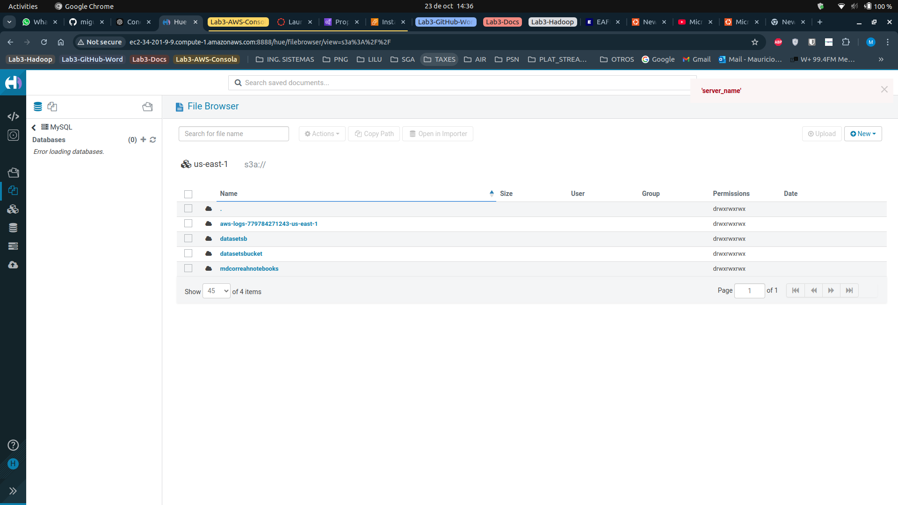
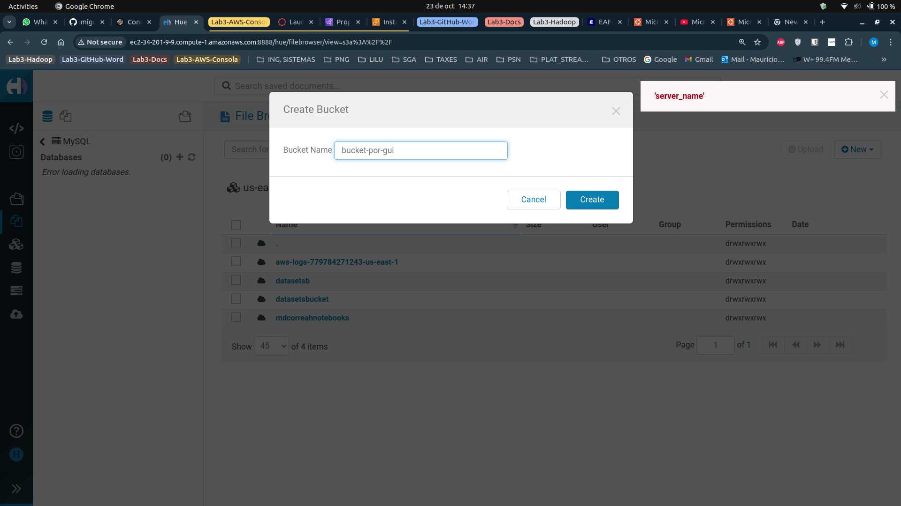
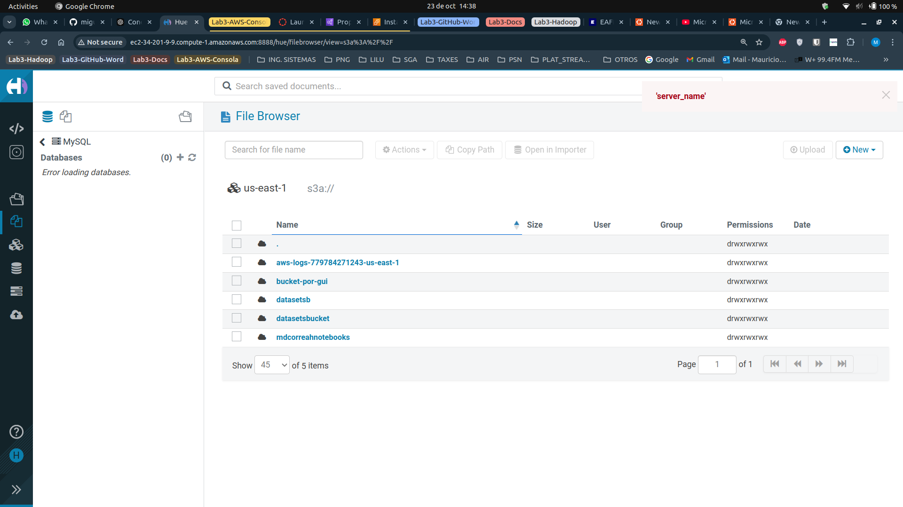
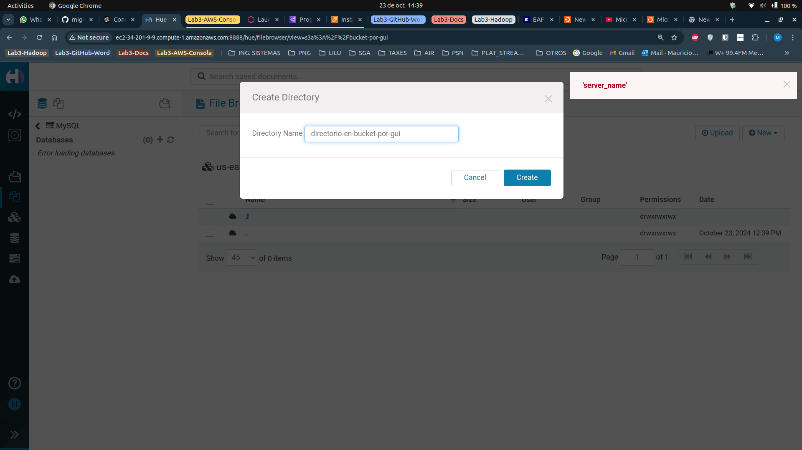
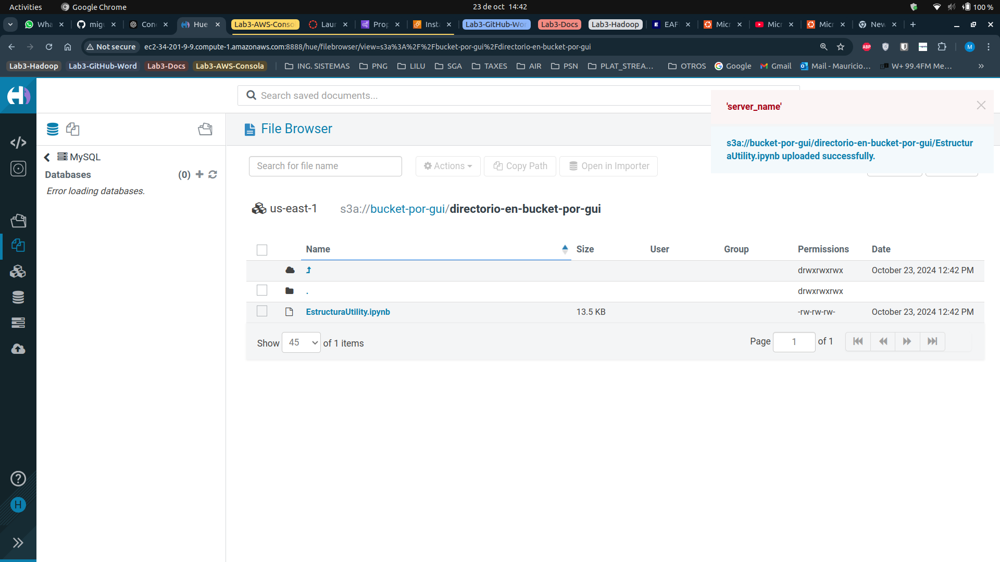
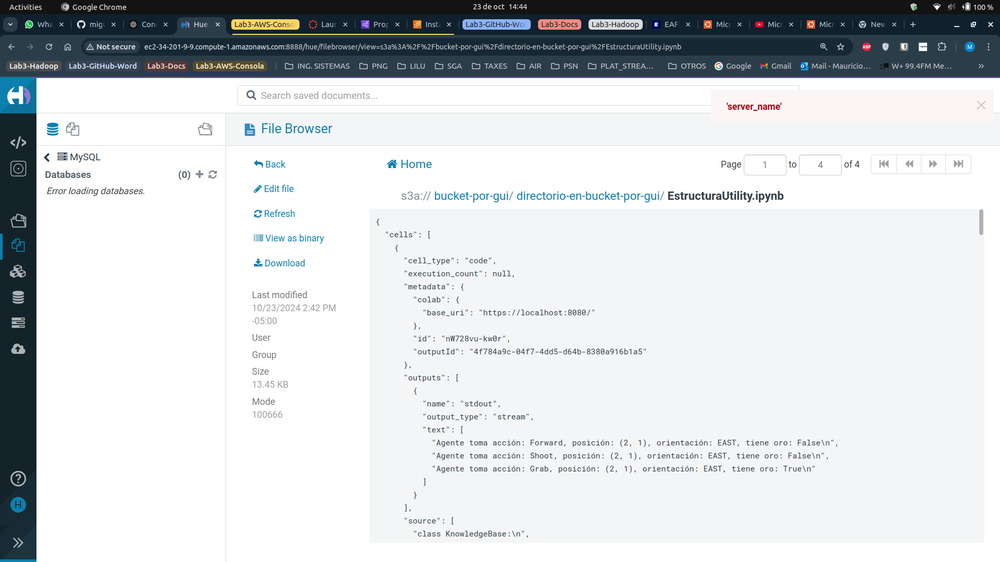
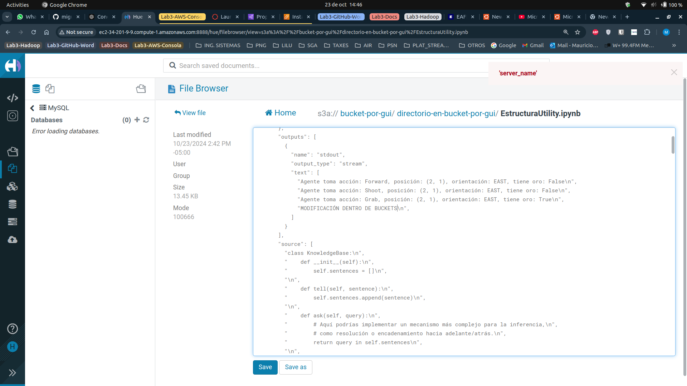
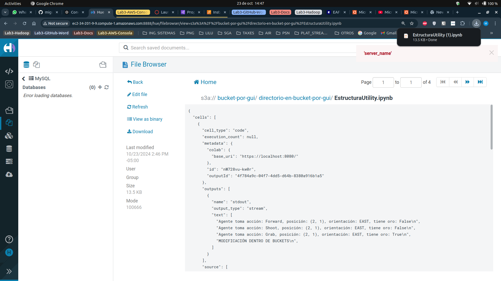
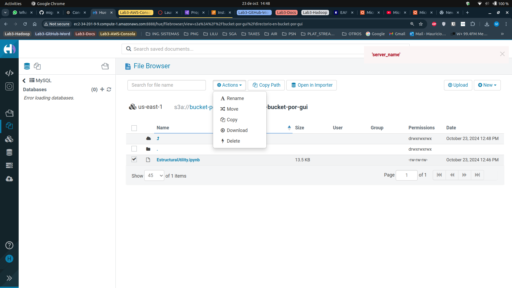

# Directorios iniciales, directorio datasets que fue creado por consola.

## Ver todos los buckets en S3.

## Crear bucket bucket-por-gui.

## Explorar todos los buckets en S3.

## Crear directorio directorio-en-bucket-por-gui en el bucket bucket-por-gui.

## Explorar directorios con directorio-en-bucket-por-gui en bucket-por-gui

## Cargar archivo EstructuraUtility.ipynb en el directorio directorio-en-bucket-por-gui en el bucket-por-gui.

## Ver contenido de EstructuraUtility.ipynb.

## Modificar contenido de EstructuraUtility.ipynb.

## Descargar archivo EstructuraUtility.ipynb.

## Más acciones en S3

