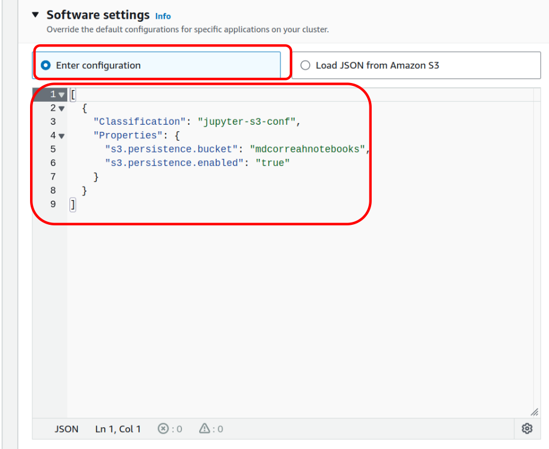

# Guía de creación y clonación de Cluster EMR.

## 1. Creación cluster EMR.

### A. Buscar el servicio AWS EMR: Entrar a la consola web de AWS y buscar el servicio EMR:


### B. Crear clúster.


### C. Nombre, Versión y Custom.


### D. Seleccionando los paquetes adecuados para el curso y activando los catálogos Glue, Hive, Spark
Nota: seleccionar los catalogos Hive y Spark permite ver las tablas AWS Glue en EMR, y las tablas Hive se podrán ver en Glue / Athena.

Seleccione los paquetes hadoop/Spark en azul.

**Nota:** a la fecha se hizo una actualización de **Hadoop**, **Spark** y **ZooKeeper**

- **HCatalog 3.1.3**
- **Hadoop**
    - (Antes) 3.3.6
    - (Actual) 3.4.0
- **Hive 3.1.3**
- **Hue 4.11.0**
- **JupyterEnterpriseGateway 2.6.0**
- **JupyterHub 1.5.0**
- **Livy 0.8.0**
- **Spark**
    - (Antes) 3.5.1
    - (Actual) 3.5.2
- **Sqoop 1.4.7**
- **Zeppelin 0.11.1**
- **ZooKeeper**
    - (Antes) 3.9.1
    - (Actual) 3.9.2


### E. Máquinas EC2 del Clúster.
Puede dejar las máquinas por defecto m5.xlarge, en algunos momentos puede fallar la creación del clúster porque no tiene suficientes recursos, puede cambiar estas máquinas a m4.xlarge, pero por defecto dejarlas como nos sugiere la creación del clúster EMR.


### F. Dejar estas opciones por defecto.


Tener en cuenta el EC2 security groups (firewall), para más adelante adicionar los diferentes puertos para las aplicaciones:

### G. Terminación de cluster.


Para que no se termine en 1 hora, mejor ponerla a que se termine manualmente.

**¡ALERTA! OJO, NO OLVIDAR TERMINARLO.**

### H. Configurar software settings.

Acá va a configurar el bucket para guardar los notebooks jupyter y no se pierdan cuando se borre el clúster EMR.

Realizar una búsqueda sencilla Google: aws emr jupyterhub s3

Nos conduce al enlace: https://docs.aws.amazon.com/emr/latest/ReleaseGuide/emr-jupyterhub-s3.html

Configurar con tu propio bucket (crear un bucket para esto)



No olvides cambiar el nombre del bicket con el nombre de tu bucket.

**Esta es la configuración a ingresar.**
```json
[
  {
    "Classification": "jupyter-s3-conf",
    "Properties": {
      "s3.persistence.bucket": "mdcorreahnotebooks",
      "s3.persistence.enabled": "true"
    }
  }
]
```

#### Importante: crear el bucket en S3 antes de ingresar a la sección de Jupyter Hub.

### I. Security configuration and EC2 key pair.


Se puede crear la llave si lo desea a la default 'vockey'.

### J. IAM roles
Debe seleccionar:
- Service role: **EMR_DefaultRole**
- Instance profile: **EMR_EC2_DefaultRole**
- Custom automatic scaling role: **EMR_AutoScaling_DefaultRole**


### K. Finalmente, a crear el clúster.


Este proceso demora aproximadamente 15 - 20 minutos, tenga paciencia.

Debe salir con este mensaje de clúster exitosamente creado:


### L. Debe abrir todos los puertos TCP para acceso al clúster así.
(nota: esto solo se hace una vez, cada vez que crea, destruya o clone un clúster, ya quedan abiertos)


También debe abrir los puertos de las aplicaciones de hadoop/Spark en el Security Group del nodo MASTER del clúster.

(nota: esto solo se hace una vez, cada vez que crea, destruya o clone un clúster, ya quedan abiertos)

Donde ubico el nodo master?

Dar Click en el clúster que acabas de crear, mirar la IP y nombre de la máquina EC2:


Luego entras al servicio EC2 de dicha máquina Master, y va a modificar el Security Group para agregar los siguientes puertos de las aplicaciones:


**Puertos.**
- **22**
- **8888**
- **8890**
- **9443**
- **9870**
- **14000**

En AWS EC2, les debería mostrar 3 máquinas:


Entrar a la pestaña de seguridad de la Instancia EC2 del nodo master:


**Reglas.**

Le damos en editar inbound rules.


Uno a uno, va adicionando los puertos, aca se adiciono el puerto 22, haga lo mismo para los demás puertos:

- Recordar darle ```0.0.0.0/0``` en source y darle Add rule.


Al final le damos guardar.


## 2. Clonación cluster EMR.

Los clúster EMR en amazon, son temporales.

Los clúster EMR no se pueden pausar

Cada que no requiera trabajar más con un clúster, DEBE BORRARLO:

Pero la próxima vez que lo requiera, puede Clonar y crear nuevamente un clúster, teniendo en cuenta la configuración de otro clúster previamente creado, esta es la opción que debe utilizar.


Cada vez que lo Clone, debe crear nuevamente el usuario hadoop / con su password de preferencia, así como realizar el arreglo del archivo hue.ini para cambiar el puerto 14000 a 9870 (esto lo entenderá más adelante)

## 3. Ingresar al clúster EMR por Hue.

Utilice la aplicación hue, por el puerto 8888 desde un browser a la ip o nombre del nodo master.

Fijarse en la aplicación del clúster HUE:


Y darle click a la URL de HUE, en este ejemplo:

http://ec2-52-3-226-179.compute-1.amazonaws.com:8888/

Cada vez que creo un cluster, me pide crear un usuario y clave:

- **Username:** hadoop
- **Passoword:** < *el que quiera* >

Nota: el usuario tiene que ser ‘hadoop`


Deberá salir una interfaz así:


Podrá acceder los servicios Hive, Spark, S3, y HDFS.

Ya va a poder gestionar archivos sin problema por hue para HDFS


## 4. Entrar a Jupyter Hub.

Utilice la aplicación jupyterhub de:


Y darle click a la URL de Jupyter Hub, en este ejemplo:

https://ec2-52-3-226-179.compute-1.amazonaws.com:9443/

OJO. No olvides haber creado el bucket en S3 con el nombre de la configuración en mi caso```mdcorreahnotebooks```.


```json
[
  {
    "Classification": "jupyter-s3-conf",
    "Properties": {
      "s3.persistence.bucket": "mdcorreahnotebooks",
      "s3.persistence.enabled": "true"
    }
  }
]
```

La primera vez, me pide crear un usuario y clave:

- **Username:** jovyan
- **Passoword:** jupyter


Tomado de: https://docs.aws.amazon.com/emr/latest/ReleaseGuide/emr-jupyterhub-user-access.html

Y listo, ya puede realizar notebooks pyspark, verifique que las 2 variables más importantes de contexto de spark esta activas en un notebook así: (primero debe crear un notebook pyspark).


Edicion de notebooks.

