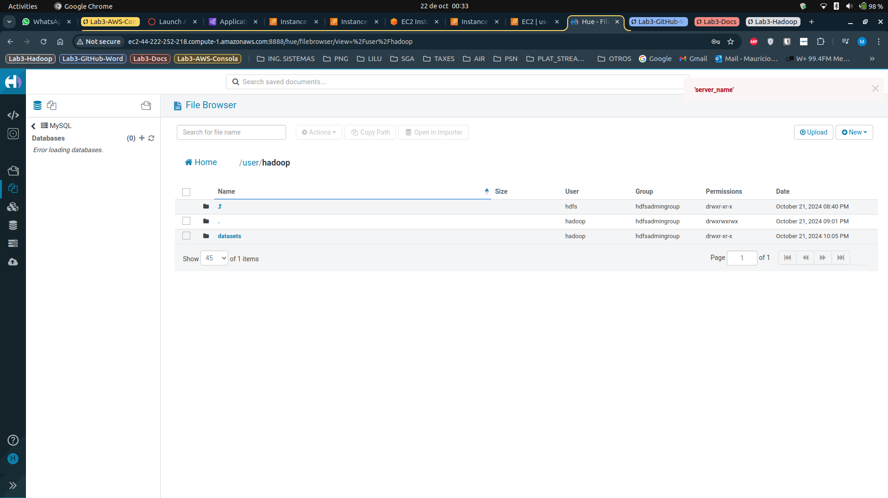
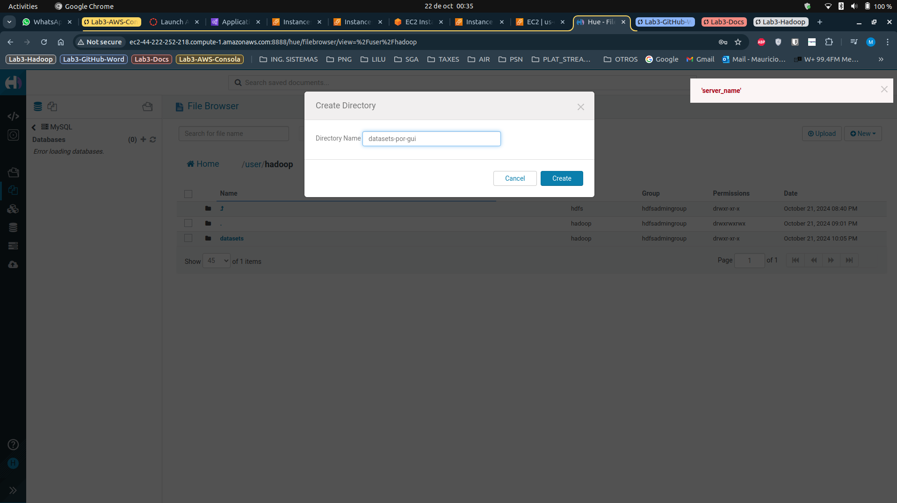
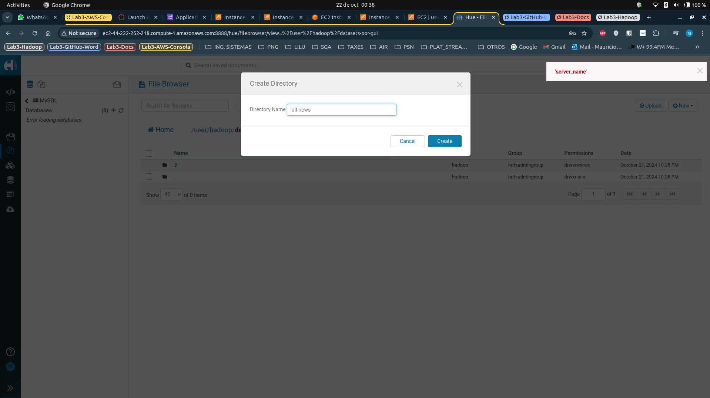
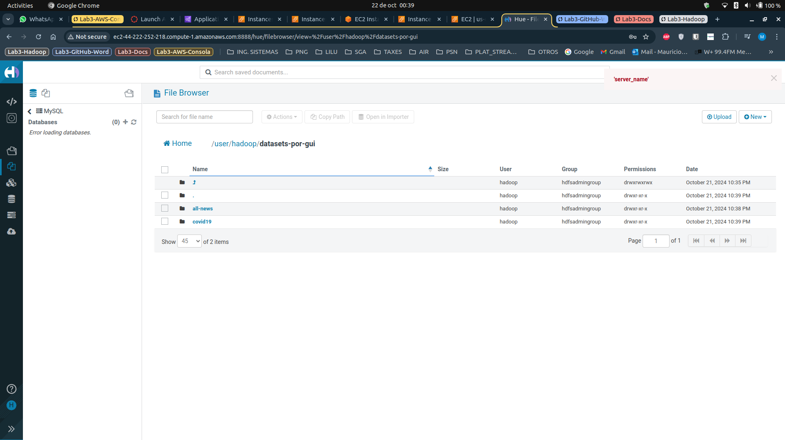
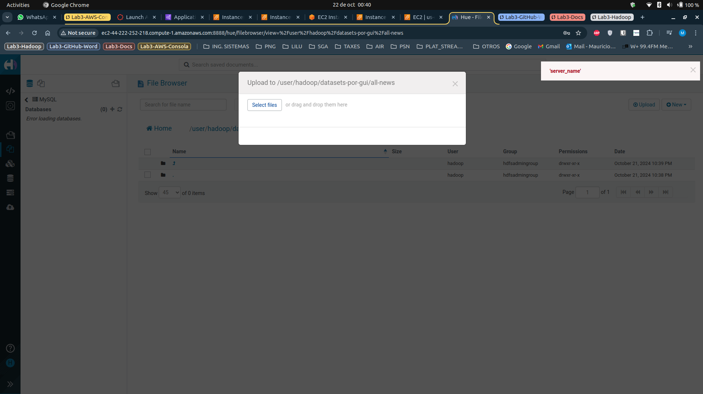
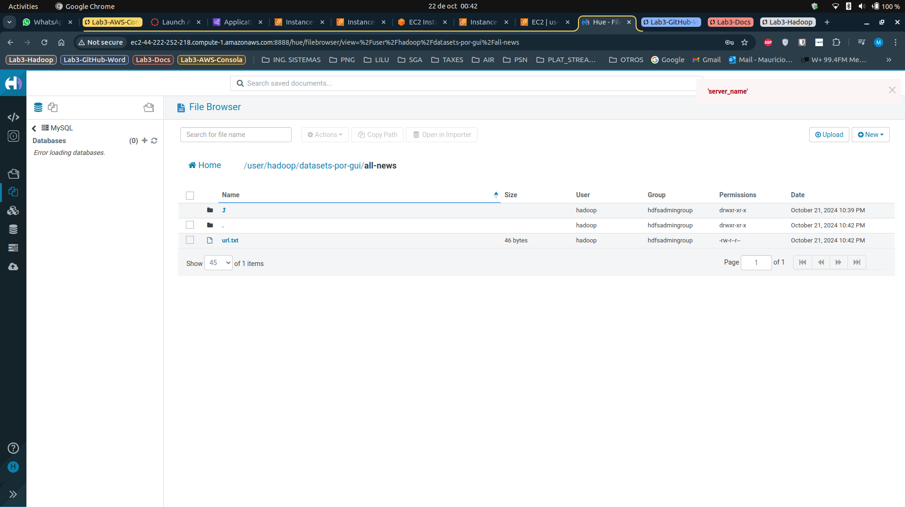
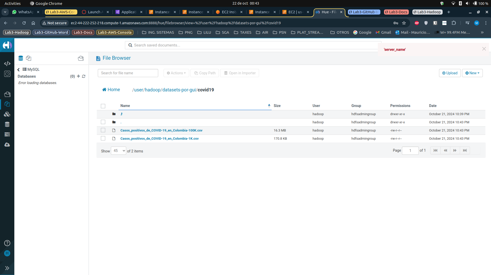
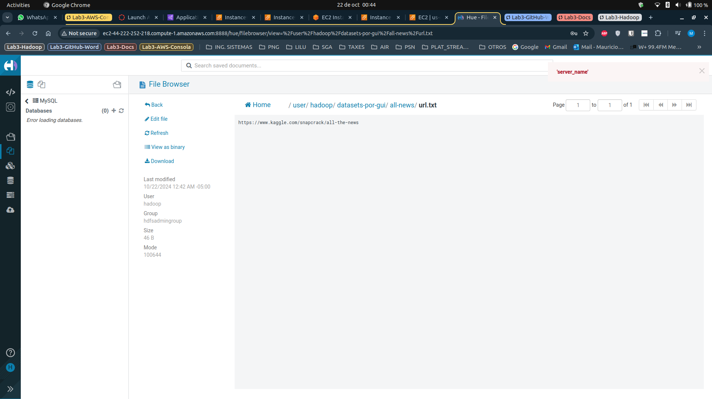
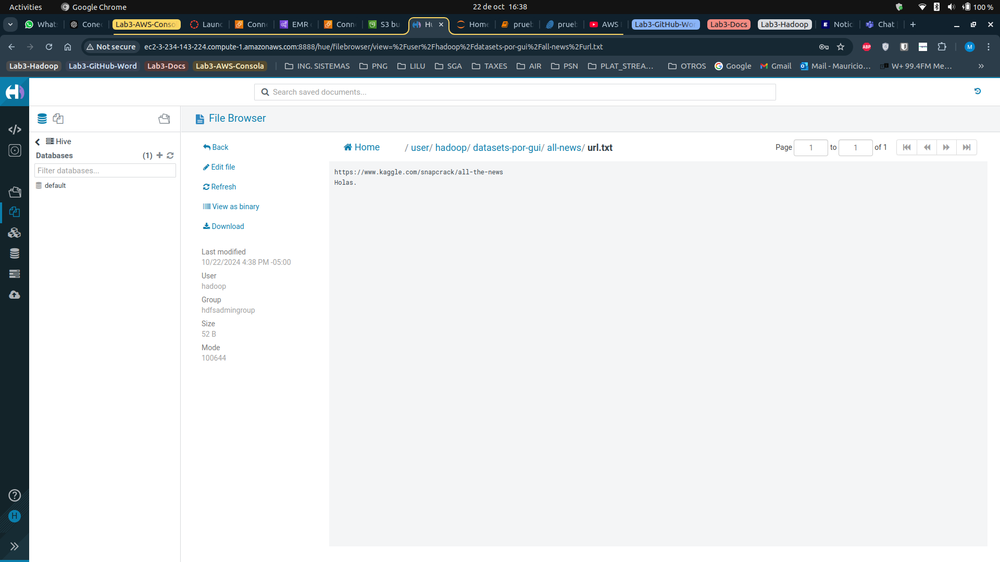
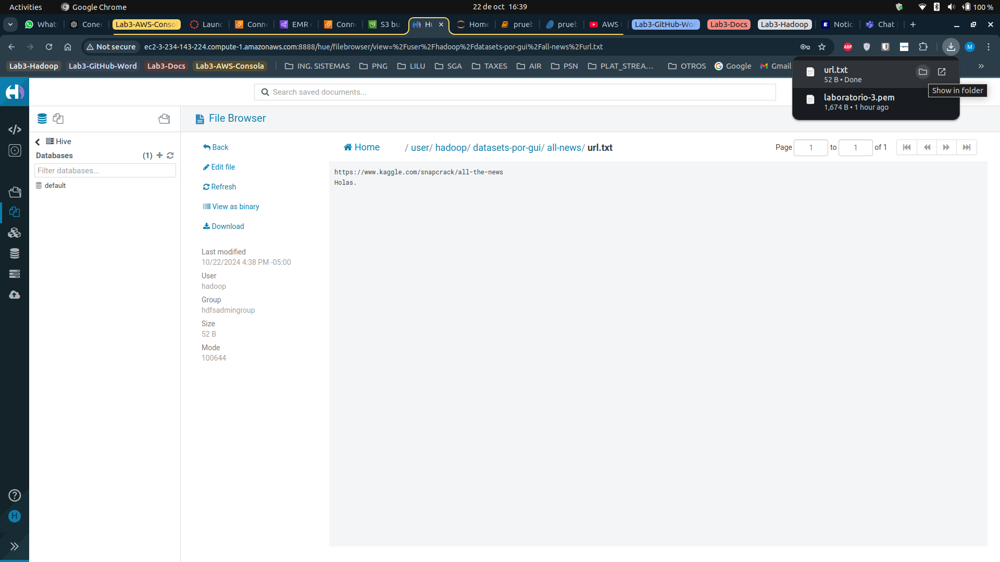

# HADOOP USANGO GUI.
### Directorios iniciales, directorio datasets que fue creado por consola.

### Crear directorio datasets-por-gui

### Explorar directorio principales

### Crear directorio all-news

### Explorar directorio datasets-por-gui con directorios all-news y Covid19.

### Cargar archivos qué están dentro del directorio all-news inicialmente sin cargarlos.

### Cargar archivos qué están dentro del directorio all-news ya cargados.

### Cargar archivos qué están dentro de covid19 ya cargados

### Ver contenido del archivo url.txt

### Modificar el contenido del archivo url.txt.

### Descargar archivo url.txt

