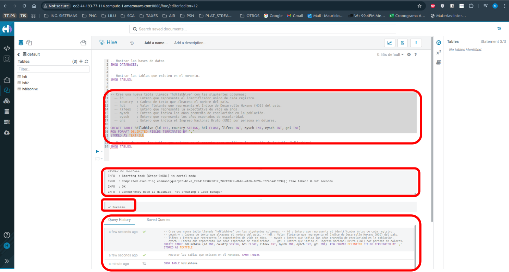
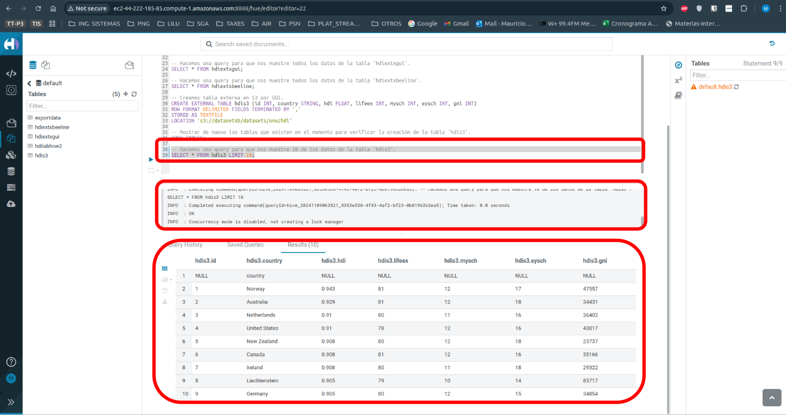

# Guía HIVE y SparkSQL, GESTIÓN DE DATOS VIA SQL:

## 1. Infraestructura:

Para ingresar a mi GUI de HIVE, primero debo de ingresar las credenciales en HUE.

### 0. Debes de crear un cluster de EMR.

Sigue esta guía para crear el cluster en EMR que está en esta directorio.

**lab3-0-aws-emr/guia-creación-cluster-emr.md**

### a. Revisa tu url de la instancia master en tu EC2.

```bash
http://ec2-44-193-77-114.compute-1.amazonaws.com:8888/
```

### b. Ingresa las credenciales para ingresar a HUE.

En mi caso voy a escoger estas. NOTA: el usuario si debe ser 'hadoop'.
```bash
Username: hadoop
Passoword: HMauricio159!!!
```


Debería salir esto así


### c. Posteriormente seleccinoas los botones que se muestran en la siguiente imágen.

- Primero el símbolo < */* >
- Luego en *Hive*


Debería salir la consola de Hive de esta manera.


### d. Vamos a crear este directorio. *'/user/hadoop/datasets/onu/hdi'*

```bash
# Verificamos que exista el directorio base.
hdfs dfs -ls /user/hadoop/

# Creamos la primer carpeta: *'/datasets'*
hdfs dfs -mkdir /user/hadoop/datasets

# Verificamos que se creó el directorio *'/datasets'*
hdfs dfs -ls /user/hadoop/datasets

# Creamos la segunda carpeta: *'/onu'*
hdfs dfs -mkdir /user/hadoop/datasets/onu

# Verificamos que se creó el directorio *'/onu'*
hdfs dfs -ls /user/hadoop/datasets/onu

# Creamos la tercera carpeta: *'/hdi'*
hdfs dfs -mkdir /user/hadoop/datasets/onu/hdi

# Verificamos que se creó el directorio *'/hdi'*
hdfs dfs -ls /user/hadoop/datasets/onu/hdi
```

Si todo salió bien, debería salir algo así.

```bash
#Verificamos que se creó el directorio *'/onu'*
[hadoop@ip-172-31-2-89 ~]$ hdfs dfs -ls /user/hadoop/datasets/onu
Found 1 items
drwxr-xr-x   - hadoop hdfsadmingroup          0 2024-11-09 00:41 /user/hadoop/datasets/onu/hdi
```

### e. Vamos a verificar los buckets que tenemos en S3.

- **Por ahora vamos a verificar por GUI dónde está el archivo que necesitamos 'hdi-data.csv' y 'export-data.csv'.**

    #### e.1. Buscamos el ícono de S3 y damos clic en él.

    

    #### e.2. Revisamos los buckets. En mi caso, los archivos están en el buucket *'datasetsb'*

    

    #### e.3. Vamos a este bucket y buscamos los archivos hasta encontrarlos. En mi caso están en el siguiente directorio,.

    ```bash
    s3a://datasetsb/datasets/onu
    ```

    

- **Ya que tenemos la ubicación de los archivos, los buscamos por consola.**

    **Comando para encontrar los archivos:**
    
    ```bash
    aws s3 ls s3://datasetsb/datasets/onu/
    ```

    Resultado:
    ```bash
    [hadoop@ip-172-31-2-89 ~]$ aws s3 ls s3://datasetsb/datasets/onu/
                            PRE export/
                            PRE hdi/
    2024-10-22 22:37:56       4423 export-data.csv
    2024-10-22 22:37:56       9235 hdi-data.csv
    2024-10-22 22:37:56        260 hdi-metadata.txt
    ```

- **Ahora vamos a traer los dos archivos que necesitamos, uno por uno.**
    **Comandos para descargar los archivos 'hdi-data.csv' y 'export-data.csv' desde S3 a Hadoop.**
    ```bash
    # Para hdi-data.csv
    hadoop fs -cp s3a://datasetsb/datasets/onu/hdi-data.csv  /user/hadoop/datasets/onu/hdi/hdi-data.csv

    # Para export-data.csv
    hadoop fs -cp s3a://datasetsb/datasets/onu/hdi-data.csv  /user/hadoop/datasets/onu/hdi/export-data.csv

    # Verificamos las descargas.
    hdfs dfs -ls /user/hadoop/datasets/onu/hdi
    ```

    Resultado:
    ```bash
    # Para hdi-data.csv
    [hadoop@ip-172-31-2-89 ~]$ hadoop fs -cp s3a://datasetsb/datasets/onu/hdi-data.csv  /user/hadoop/datasets/onu/hdi/hdi-data.csv
    2024-11-09 01:20:57,031 INFO impl.MetricsConfig: Loaded properties from hadoop-metrics2.properties
    2024-11-09 01:20:57,131 INFO impl.MetricsSystemImpl: Scheduled Metric snapshot period at 300 second(s).
    2024-11-09 01:20:57,132 INFO impl.MetricsSystemImpl: s3a-file-system metrics system started
    2024-11-09 01:20:57,592 WARN impl.ConfigurationHelper: Option fs.s3a.connection.establish.timeout is too low (5,000 ms). Setting to 15,000 ms instead
    2024-11-09 01:21:00,627 INFO impl.MetricsSystemImpl: Stopping s3a-file-system metrics system...
    2024-11-09 01:21:00,627 INFO impl.MetricsSystemImpl: s3a-file-system metrics system stopped.
    2024-11-09 01:21:00,627 INFO impl.MetricsSystemImpl: s3a-file-system metrics system shutdown complete.

    # Para export-data.csv
    [hadoop@ip-172-31-2-89 ~]$ hadoop fs -cp s3a://datasetsb/datasets/onu/hdi-data.csv  /user/hadoop/datasets/onu/hdi/export-data.csv
    2024-11-09 01:21:22,095 INFO impl.MetricsConfig: Loaded properties from hadoop-metrics2.properties
    2024-11-09 01:21:22,200 INFO impl.MetricsSystemImpl: Scheduled Metric snapshot period at 300 second(s).
    2024-11-09 01:21:22,200 INFO impl.MetricsSystemImpl: s3a-file-system metrics system started
    2024-11-09 01:21:22,366 WARN impl.ConfigurationHelper: Option fs.s3a.connection.establish.timeout is too low (5,000 ms). Setting to 15,000 ms instead
    2024-11-09 01:21:24,395 INFO impl.MetricsSystemImpl: Stopping s3a-file-system metrics system...
    2024-11-09 01:21:24,395 INFO impl.MetricsSystemImpl: s3a-file-system metrics system stopped.
    2024-11-09 01:21:24,395 INFO impl.MetricsSystemImpl: s3a-file-system metrics system shutdown complete.
    
    # Verificamos las descargas.
    [hadoop@ip-172-31-2-89 ~]$ hdfs dfs -ls /user/hadoop/datasets/onu/hdi
    Found 2 items
    -rw-r--r--   1 hadoop hdfsadmingroup       9235 2024-11-09 01:21 /user/hadoop/datasets/onu/hdi/export-data.csv
    -rw-r--r--   1 hadoop hdfsadmingroup       9235 2024-11-09 01:21 /user/hadoop/datasets/onu/hdi/hdi-data.csv
    ```
- **Verificamos la creación por medio del GUI ya que ya es confirmó por comandos.**

    

## 2. Gestión (DDL) y Consultas (DQL)

### Crear la tabla 'hdilabhive' por GUI.

```sql
-- Mostrar las bases de datos
SHOW DATABASES;

-- Mostrar las tablas que existen en el momento.
SHOW TABLES;

-- Crea una nueva tabla llamada "hdilabhive" con las siguientes columnas:
  -- id       : Entero que representa el identificador único de cada registro.
  -- country  : Cadena de texto que almacena el nombre del país.
  -- hdi      : Valor flotante que representa el Índice de Desarrollo Humano (HDI) del país.
  -- lifeex   : Entero que representa la expectativa de vida en años.
  -- mysch    : Entero que indica los años promedio de escolaridad en la población.
  -- eysch    : Entero que representa los años esperados de escolaridad.
  -- gni      : Entero que indica el Ingreso Nacional Bruto (GNI) por persona en dólares.

CREATE TABLE hdilabhive (id INT, country STRING, hdi FLOAT, lifeex INT, mysch INT, eysch INT, gni INT) 
ROW FORMAT DELIMITED FIELDS TERMINATED BY ','
STORED AS TEXTFILE

-- Mostrar de nuevo las tablas que existen en el momento pare verificar la creación de la tabla 'hdilabhive'.
SHOW TABLES;
```





### Crear la tabla 'hdilabhive2' en HDFS/beeline:

Para trabajar con 'beeline', tenemos que ejecutar los siguientes comandos.
```bash
[hadoop@ip-172-31-2-89 ~]$ beeline
Beeline version 3.1.3-amzn-13 by Apache Hive
beeline> !connect jdbc:hive2://localhost:10000

# Cuando hacemos esto, conectamos a hive2 en el host local y puerto 10000. Ahora necesitamos crear un usuario y contraseña.
# username: <<el-que-desees>>
# password: <<el-que-desees>>
```
Resultado
```bash
Connecting to jdbc:hive2://localhost:10000
Enter username for jdbc:hive2://localhost:10000: mauricio
Enter password for jdbc:hive2://localhost:10000: ********
Connected to: Apache Hive (version 3.1.3-amzn-13)
Driver: Hive JDBC (version 3.1.3-amzn-13)
Transaction isolation: TRANSACTION_REPEATABLE_READ


# Comando para ver las bases de datos.
0: jdbc:hive2://localhost:10000> SHOW DATABASES;
INFO  : Compiling command(queryId=hive_20241109030236_760456b2-d90d-4915-a24c-86cff69d643f): SHOW DATABASES
INFO  : Concurrency mode is disabled, not creating a lock manager
INFO  : Semantic Analysis Completed (retrial = false)
INFO  : Returning Hive schema: Schema(fieldSchemas:[FieldSchema(name:database_name, type:string, comment:from deserializer)], properties:null)
INFO  : Completed compiling command(queryId=hive_20241109030236_760456b2-d90d-4915-a24c-86cff69d643f); Time taken: 0.004 seconds
INFO  : Concurrency mode is disabled, not creating a lock manager
INFO  : Executing command(queryId=hive_20241109030236_760456b2-d90d-4915-a24c-86cff69d643f): SHOW DATABASES
INFO  : Starting task [Stage-0:DDL] in serial mode
INFO  : Completed executing command(queryId=hive_20241109030236_760456b2-d90d-4915-a24c-86cff69d643f); Time taken: 0.08 seconds
INFO  : OK
INFO  : Concurrency mode is disabled, not creating a lock manager
+----------------+
| database_name  |
+----------------+
| default        |
+----------------+
1 row selected (0.148 seconds)
0: jdbc:hive2://localhost:10000> 

# USAMOS LA BASE DE DATOS QUE REQUIRAMOS, EN ESTE CASO ES default.
0: jdbc:hive2://localhost:10000> USE default;
INFO  : Compiling command(queryId=hive_20241109030756_45213c81-047e-4cdf-8456-969f67507406): USE default
INFO  : Concurrency mode is disabled, not creating a lock manager
INFO  : Semantic Analysis Completed (retrial = false)
INFO  : Returning Hive schema: Schema(fieldSchemas:null, properties:null)
INFO  : Completed compiling command(queryId=hive_20241109030756_45213c81-047e-4cdf-8456-969f67507406); Time taken: 0.104 seconds
INFO  : Concurrency mode is disabled, not creating a lock manager
INFO  : Executing command(queryId=hive_20241109030756_45213c81-047e-4cdf-8456-969f67507406): USE default
INFO  : Starting task [Stage-0:DDL] in serial mode
INFO  : Completed executing command(queryId=hive_20241109030756_45213c81-047e-4cdf-8456-969f67507406); Time taken: 0.176 seconds
INFO  : OK
INFO  : Concurrency mode is disabled, not creating a lock manager
No rows affected (0.293 seconds)

# CREAMOS UNA NUEVA TABLA LLAMADA 'hdilabhive2'
0: jdbc:hive2://localhost:10000> CREATE TABLE hdilabhive2 (id INT, country STRING, hdi FLOAT, lifeex INT, mysch INT, eysch INT, gni INT) 
. . . . . . . . . . . . . . . .> ROW FORMAT DELIMITED FIELDS TERMINATED BY ','
. . . . . . . . . . . . . . . .> STORED AS TEXTFILE
. . . . . . . . . . . . . . . .> ;
INFO  : Compiling command(queryId=hive_20241109031043_5c520e1c-5643-4f84-98ce-844f1fbcf0b7): CREATE TABLE hdilabhive2 (id INT, country STRING, hdi FLOAT, lifeex INT, mysch INT, eysch INT, gni INT)
ROW FORMAT DELIMITED FIELDS TERMINATED BY ','
STORED AS TEXTFILE
INFO  : Concurrency mode is disabled, not creating a lock manager
INFO  : Semantic Analysis Completed (retrial = false)
INFO  : Returning Hive schema: Schema(fieldSchemas:null, properties:null)
INFO  : Completed compiling command(queryId=hive_20241109031043_5c520e1c-5643-4f84-98ce-844f1fbcf0b7); Time taken: 0.099 seconds
INFO  : Concurrency mode is disabled, not creating a lock manager
INFO  : Executing command(queryId=hive_20241109031043_5c520e1c-5643-4f84-98ce-844f1fbcf0b7): CREATE TABLE hdilabhive2 (id INT, country STRING, hdi FLOAT, lifeex INT, mysch INT, eysch INT, gni INT)
ROW FORMAT DELIMITED FIELDS TERMINATED BY ','
STORED AS TEXTFILE
INFO  : Starting task [Stage-0:DDL] in serial mode
INFO  : Completed executing command(queryId=hive_20241109031043_5c520e1c-5643-4f84-98ce-844f1fbcf0b7); Time taken: 0.467 seconds
INFO  : OK
INFO  : Concurrency mode is disabled, not creating a lock manager
No rows affected (0.579 seconds)

# REVISAMOS LA CREACIÓN DE LAS TABLAS.
0: jdbc:hive2://localhost:10000> SHOW TABLES;
INFO  : Compiling command(queryId=hive_20241109031132_4bdc0172-3bb5-4010-adec-3351d678d941): SHOW TABLES
INFO  : Concurrency mode is disabled, not creating a lock manager
INFO  : Semantic Analysis Completed (retrial = false)
INFO  : Returning Hive schema: Schema(fieldSchemas:[FieldSchema(name:tab_name, type:string, comment:from deserializer)], properties:null)
INFO  : Completed compiling command(queryId=hive_20241109031132_4bdc0172-3bb5-4010-adec-3351d678d941); Time taken: 0.091 seconds
INFO  : Concurrency mode is disabled, not creating a lock manager
INFO  : Executing command(queryId=hive_20241109031132_4bdc0172-3bb5-4010-adec-3351d678d941): SHOW TABLES
INFO  : Starting task [Stage-0:DDL] in serial mode
INFO  : Completed executing command(queryId=hive_20241109031132_4bdc0172-3bb5-4010-adec-3351d678d941); Time taken: 0.207 seconds
INFO  : OK
INFO  : Concurrency mode is disabled, not creating a lock manager
+--------------+
|   tab_name   |
+--------------+
| hdi          |
| hdi2         |
| hdilabhive   |
| hdilabhive2  |     --> AQUÍ LA PODEMOS VER CREADA :P
+--------------+
4 rows selected (0.316 seconds)
```

### Verificamos que 'hdfs:///user/hive/warehouse/hdilabhive2' y el archivo *'hdi-data.csv'* y *'export-data.csv'* existe en 'hdfs:///user/hadoop/datasets/onu/hdi/'.

Comandos.
```bash
# Comando para verificar la tabla 'hdilabhive2'
hdfs dfs -ls hdfs:///user/hive/warehouse/hdilabhive2

# Comando para verificar que existan los archivos.
hdfs dfs -ls hdfs:///user/hadoop/datasets/onu/hdi/
```

Resultado.
```bash
[hadoop@ip-172-31-12-155 ~]$ hdfs dfs -ls hdfs:///user/hive/warehouse/hdilabhive2
[hadoop@ip-172-31-12-155 ~]$ hdfs dfs -ls hdfs:///user/hadoop/datasets/onu/hdi/
Found 2 items
-rw-r--r--   1 hadoop hdfsadmingroup       9235 2024-11-09 04:05 hdfs:///user/hadoop/datasets/onu/hdi/export-data.csv
-rw-r--r--   1 hadoop hdfsadmingroup       9235 2024-11-09 04:04 hdfs:///user/hadoop/datasets/onu/hdi/hdi-data.csv
```

### Opciones para cargar datos a la tabla asi:
#### Opción N° 1.

- Copiando datos directamente hacia hdfs:///user/hive/warehouse/hdilabhive2/

    Comandos.
    ```bash
    hdfs dfs -cp hdfs:///user/hadoop/datasets/onu/hdi/hdi-data.csv hdfs:///user/hive/warehouse/hdilabhive2/hdi-data.csv
    ```

    Resultado.
    ```bash
    [hadoop@ip-172-31-12-155 ~]$ hdfs dfs -cp hdfs:///user/hadoop/datasets/onu/hdi/hdi-data.csv hdfs:///user/hive/warehouse/hdilabhive2/hdi-data.csv
    [hadoop@ip-172-31-12-155 ~]$ hdfs dfs -ls hdfs:///user/hive/warehouse/hdilabhive2
    Found 1 items
    -rw-r--r--   1 hadoop hdfsadmingroup       9235 2024-11-09 04:22 hdfs:///user/hive/warehouse/hdilabhive2/hdi-data.csv
    ```
    Si hacemos estos comandos en la terminal de Hive, vamos a optener los resultados deseados.

    ```sql
    -- Mostrar de nuevo las tablas que existen en el momento pare verificar la creación de la tabla 'hdilabhive2'.
    SHOW TABLES;

    -- Hacemos una query para que nos muestre todos los datos de la tabla 'hdilabhive2'.
    SELECT * FROM hdilabhive2;
    ```

    

    

    O usando 'beeline'

    Comandos.
    ```bash
    # Comando para conexión
    [hadoop@ip-172-31-12-155 ~]$ beeline
    beeline> !connect jdbc:hive2://localhost:10000
    Enter username for jdbc:hive2://localhost:10000: mauricio
    Enter password for jdbc:hive2://localhost:10000: *********
    # Comando para mostrar tablas.
    0: jdbc:hive2://localhost:10000> SHOW TABLES;
    
    # Comando para mostrar las 10 primeras entradas de la base de datos 'hdilabhive2'
    0: jdbc:hive2://localhost:10000> SELECT * FROM hdilabhive2 LIMIT 10;
    ```

    Resultado.

    ```sql
    [hadoop@ip-172-31-12-155 ~]$ beeline
    Beeline version 3.1.3-amzn-13 by Apache Hive
    beeline> !connect jdbc:hive2://localhost:10000
    Connecting to jdbc:hive2://localhost:10000
    Enter username for jdbc:hive2://localhost:10000: mauricio
    Enter password for jdbc:hive2://localhost:10000: *********
    Connected to: Apache Hive (version 3.1.3-amzn-13)
    Driver: Hive JDBC (version 3.1.3-amzn-13)
    Transaction isolation: TRANSACTION_REPEATABLE_READ
    0: jdbc:hive2://localhost:10000> SHOW TABLES;
    INFO  : Compiling command(queryId=hive_20241109043857_884ba883-36c8-43cd-bff0-cccf4c45d3ef): SHOW TABLES
    INFO  : Concurrency mode is disabled, not creating a lock manager
    INFO  : Semantic Analysis Completed (retrial = false)
    INFO  : Returning Hive schema: Schema(fieldSchemas:[FieldSchema(name:tab_name, type:string, comment:from deserializer)], properties:null)
    INFO  : Completed compiling command(queryId=hive_20241109043857_884ba883-36c8-43cd-bff0-cccf4c45d3ef); Time taken: 0.097 seconds
    INFO  : Concurrency mode is disabled, not creating a lock manager
    INFO  : Executing command(queryId=hive_20241109043857_884ba883-36c8-43cd-bff0-cccf4c45d3ef): SHOW TABLES
    INFO  : Starting task [Stage-0:DDL] in serial mode
    INFO  : Completed executing command(queryId=hive_20241109043857_884ba883-36c8-43cd-bff0-cccf4c45d3ef); Time taken: 0.21 seconds
    INFO  : OK
    INFO  : Concurrency mode is disabled, not creating a lock manager
    +--------------+
    |   tab_name   |
    +--------------+
    | hdilabhive2  |
    +--------------+
    1 row selected (0.38 seconds)

    0: jdbc:hive2://localhost:10000> SELECT * FROM hdilabhive2 LIMIT 10;
    INFO  : Compiling command(queryId=hive_20241109043936_a893e396-aca5-4685-8735-971b33e2ca6e): SELECT * FROM hdilabhive2 LIMIT 10
    INFO  : Concurrency mode is disabled, not creating a lock manager
    INFO  : Semantic Analysis Completed (retrial = false)
    INFO  : Returning Hive schema: Schema(fieldSchemas:[FieldSchema(name:hdilabhive2.id, type:int, comment:null), FieldSchema(name:hdilabhive2.country, type:string, comment:null), FieldSchema(name:hdilabhive2.hdi, type:float, comment:null), FieldSchema(name:hdilabhive2.lifeex, type:int, comment:null), FieldSchema(name:hdilabhive2.mysch, type:int, comment:null), FieldSchema(name:hdilabhive2.eysch, type:int, comment:null), FieldSchema(name:hdilabhive2.gni, type:int, comment:null)], properties:null)
    INFO  : Completed compiling command(queryId=hive_20241109043936_a893e396-aca5-4685-8735-971b33e2ca6e); Time taken: 0.396 seconds
    INFO  : Concurrency mode is disabled, not creating a lock manager
    INFO  : Executing command(queryId=hive_20241109043936_a893e396-aca5-4685-8735-971b33e2ca6e): SELECT * FROM hdilabhive2 LIMIT 10
    INFO  : Completed executing command(queryId=hive_20241109043936_a893e396-aca5-4685-8735-971b33e2ca6e); Time taken: 0.002 seconds
    INFO  : OK
    INFO  : Concurrency mode is disabled, not creating a lock manager
    +-----------------+----------------------+------------------+---------------------+--------------------+--------------------+------------------+
    | hdilabhive2.id  | hdilabhive2.country  | hdilabhive2.hdi  | hdilabhive2.lifeex  | hdilabhive2.mysch  | hdilabhive2.eysch  | hdilabhive2.gni  |
    +-----------------+----------------------+------------------+---------------------+--------------------+--------------------+------------------+
    | NULL            | country              | NULL             | NULL                | NULL               | NULL               | NULL             |
    | 1               | Norway               | 0.943            | 81                  | 12                 | 17                 | 47557            |
    | 2               | Australia            | 0.929            | 81                  | 12                 | 18                 | 34431            |
    | 3               | Netherlands          | 0.91             | 80                  | 11                 | 16                 | 36402            |
    | 4               | United States        | 0.91             | 78                  | 12                 | 16                 | 43017            |
    | 5               | New Zealand          | 0.908            | 80                  | 12                 | 18                 | 23737            |
    | 6               | Canada               | 0.908            | 81                  | 12                 | 16                 | 35166            |
    | 7               | Ireland              | 0.908            | 80                  | 11                 | 18                 | 29322            |
    | 8               | Liechtenstein        | 0.905            | 79                  | 10                 | 14                 | 83717            |
    | 9               | Germany              | 0.905            | 80                  | 12                 | 15                 | 34854            |
    +-----------------+----------------------+------------------+---------------------+--------------------+--------------------+------------------+
    10 rows selected (0.431 seconds)
    0: jdbc:hive2://localhost:10000> 
    ```


#### OPCIÓN 2:
- Cargardo datos desde hive:

    - Darle primero permisos completos al directorio:

    ```bash
    hdfs dfs -chmod -R 777 /user/hadoop/datasets/onu/
    ```
    ```bash
    # Creamos la conexión a beeline.
    beeline -u "jdbc:hive2://localhost:10000/default"

    # Creamos la tabla nueva de prueba, verificando cuales son los datos del archivo que vamos a subir.
    0: jdbc:hive2://localhost:10000/default> CREATE TABLE exportdata (
    . . . . . . . . . . . . . . . . . . . .>     id INT,
    . . . . . . . . . . . . . . . . . . . .>     country STRING,
    . . . . . . . . . . . . . . . . . . . .>     hdi FLOAT,
    . . . . . . . . . . . . . . . . . . . .>     lifeex INT,
    . . . . . . . . . . . . . . . . . . . .>     myschool INT,
    . . . . . . . . . . . . . . . . . . . .>     eyschool INT,
    . . . . . . . . . . . . . . . . . . . .>     gni INT,
    . . . . . . . . . . . . . . . . . . . .>     gni2 INT,
    . . . . . . . . . . . . . . . . . . . .>     nihdi FLOAT
    . . . . . . . . . . . . . . . . . . . .> )
    . . . . . . . . . . . . . . . . . . . .> ROW FORMAT DELIMITED 
    . . . . . . . . . . . . . . . . . . . .> FIELDS TERMINATED BY ',' 
    . . . . . . . . . . . . . . . . . . . .> STORED AS TEXTFILE;
    
    # Verificaos la creación de la tabla.
    0: jdbc:hive2://localhost:10000/default> SHOW TABLES;

    # Cargar los datos en la tabla exportdata desde HDFS.
    0: jdbc:hive2://localhost:10000/default> LOAD DATA INPATH '/user/hadoop/datasets/onu/hdi/export-data.csv' INTO TABLE exportdata;

    # Cargamos los datos desde la tabla con un límite de 10 salidas para que no me muestre todo.
    0: jdbc:hive2://localhost:10000/default> SELECT * FROM exportdata LIMIT 10;
    ```

    Resultados.
    ```bash
    [hadoop@ip-172-31-12-155 ~]$ hdfs dfs -chmod -R 777 /user/hadoop/datasets/onu/
    [hadoop@ip-172-31-12-155 ~]$ hdfs dfs -ls /user/hadoop/datasets/onu/
    Found 1 items
    drwxrwxrwx   - hadoop hdfsadmingroup          0 2024-11-09 04:05 /user/hadoop/datasets/onu/hdi
    [hadoop@ip-172-31-12-155 ~]$ hdfs dfs -ls /user/hadoop/datasets/onu/hdi
    Found 2 items
    -rwxrwxrwx   1 hadoop hdfsadmingroup       9235 2024-11-09 04:05 /user/hadoop/datasets/onu/hdi/export-data.csv
    -rwxrwxrwx   1 hadoop hdfsadmingroup       9235 2024-11-09 04:04 /user/hadoop/datasets/onu/hdi/hdi-data.csv
    [hadoop@ip-172-31-12-155 ~]$ $ beeline -u "jdbc:hive2://localhost:10000/default"
    -bash: $: command not found
    [hadoop@ip-172-31-12-155 ~]$ beeline -u "jdbc:hive2://localhost:10000/default"
    Connecting to jdbc:hive2://localhost:10000/default
    Connected to: Apache Hive (version 3.1.3-amzn-13)
    Driver: Hive JDBC (version 3.1.3-amzn-13)
    Transaction isolation: TRANSACTION_REPEATABLE_READ
    Beeline version 3.1.3-amzn-13 by Apache Hive
    0: jdbc:hive2://localhost:10000/default> CREATE TABLE exportdata (
    . . . . . . . . . . . . . . . . . . . .>     id INT,
    . . . . . . . . . . . . . . . . . . . .>     country STRING,
    . . . . . . . . . . . . . . . . . . . .>     hdi FLOAT,
    . . . . . . . . . . . . . . . . . . . .>     lifeex INT,
    . . . . . . . . . . . . . . . . . . . .>     myschool INT,
    . . . . . . . . . . . . . . . . . . . .>     eyschool INT,
    . . . . . . . . . . . . . . . . . . . .>     gni INT,
    . . . . . . . . . . . . . . . . . . . .>     gni2 INT,
    . . . . . . . . . . . . . . . . . . . .>     nihdi FLOAT
    . . . . . . . . . . . . . . . . . . . .> )
    . . . . . . . . . . . . . . . . . . . .> ROW FORMAT DELIMITED 
    . . . . . . . . . . . . . . . . . . . .> FIELDS TERMINATED BY ',' 
    . . . . . . . . . . . . . . . . . . . .> STORED AS TEXTFILE;
    INFO  : Compiling command(queryId=hive_20241109051750_92ac5616-270c-4f4e-a331-614f3e80cd07): CREATE TABLE exportdata (
    id INT,
    country STRING,
    hdi FLOAT,
    lifeex INT,
    myschool INT,
    eyschool INT,
    gni INT,
    gni2 INT,
    nihdi FLOAT
    )
    ROW FORMAT DELIMITED
    FIELDS TERMINATED BY ','
    STORED AS TEXTFILE
    INFO  : Concurrency mode is disabled, not creating a lock manager
    INFO  : Semantic Analysis Completed (retrial = false)
    INFO  : Returning Hive schema: Schema(fieldSchemas:null, properties:null)
    INFO  : Completed compiling command(queryId=hive_20241109051750_92ac5616-270c-4f4e-a331-614f3e80cd07); Time taken: 0.098 seconds
    INFO  : Concurrency mode is disabled, not creating a lock manager
    INFO  : Executing command(queryId=hive_20241109051750_92ac5616-270c-4f4e-a331-614f3e80cd07): CREATE TABLE exportdata (
    id INT,
    country STRING,
    hdi FLOAT,
    lifeex INT,
    myschool INT,
    eyschool INT,
    gni INT,
    gni2 INT,
    nihdi FLOAT
    )
    ROW FORMAT DELIMITED
    FIELDS TERMINATED BY ','
    STORED AS TEXTFILE
    INFO  : Starting task [Stage-0:DDL] in serial mode
    INFO  : Completed executing command(queryId=hive_20241109051750_92ac5616-270c-4f4e-a331-614f3e80cd07); Time taken: 0.418 seconds
    INFO  : OK
    INFO  : Concurrency mode is disabled, not creating a lock manager
    No rows affected (0.555 seconds)
    0: jdbc:hive2://localhost:10000/default> SHOW TABLES;
    INFO  : Compiling command(queryId=hive_20241109051818_5eafda6e-2234-48a4-aa4e-70ffb35102b4): SHOW TABLES
    INFO  : Concurrency mode is disabled, not creating a lock manager
    INFO  : Semantic Analysis Completed (retrial = false)
    INFO  : Returning Hive schema: Schema(fieldSchemas:[FieldSchema(name:tab_name, type:string, comment:from deserializer)], properties:null)
    INFO  : Completed compiling command(queryId=hive_20241109051818_5eafda6e-2234-48a4-aa4e-70ffb35102b4); Time taken: 0.094 seconds
    INFO  : Concurrency mode is disabled, not creating a lock manager
    INFO  : Executing command(queryId=hive_20241109051818_5eafda6e-2234-48a4-aa4e-70ffb35102b4): SHOW TABLES
    INFO  : Starting task [Stage-0:DDL] in serial mode
    INFO  : Completed executing command(queryId=hive_20241109051818_5eafda6e-2234-48a4-aa4e-70ffb35102b4); Time taken: 0.235 seconds
    INFO  : OK
    INFO  : Concurrency mode is disabled, not creating a lock manager
    +--------------+
    |   tab_name   |
    +--------------+
    | exportdata   |
    | hdilabhive2  |
    +--------------+
    2 rows selected (0.366 seconds)
    0: jdbc:hive2://localhost:10000/default> LOAD DATA INPATH '/user/hadoop/datasets/onu/hdi/export-data.csv' INTO TABLE exportdata;
    INFO  : Compiling command(queryId=hive_20241109051930_50ba1480-8357-4283-8f2e-bacf7d4c6680): LOAD DATA INPATH '/user/hadoop/datasets/onu/hdi/export-data.csv' INTO TABLE exportdata
    INFO  : Concurrency mode is disabled, not creating a lock manager
    INFO  : Semantic Analysis Completed (retrial = false)
    INFO  : Returning Hive schema: Schema(fieldSchemas:null, properties:null)
    INFO  : Completed compiling command(queryId=hive_20241109051930_50ba1480-8357-4283-8f2e-bacf7d4c6680); Time taken: 0.146 seconds
    INFO  : Concurrency mode is disabled, not creating a lock manager
    INFO  : Executing command(queryId=hive_20241109051930_50ba1480-8357-4283-8f2e-bacf7d4c6680): LOAD DATA INPATH '/user/hadoop/datasets/onu/hdi/export-data.csv' INTO TABLE exportdata
    INFO  : Starting task [Stage-0:MOVE] in serial mode
    INFO  : Loading data to table default.exportdata from hdfs://ip-172-31-12-155.ec2.internal:8020/user/hadoop/datasets/onu/hdi/export-data.csv
    INFO  : Starting task [Stage-1:STATS] in serial mode
    INFO  : Executing stats task
    INFO  : Table default.exportdata stats: [numFiles=1, numRows=0, totalSize=9235, rawDataSize=0]
    INFO  : Completed executing command(queryId=hive_20241109051930_50ba1480-8357-4283-8f2e-bacf7d4c6680); Time taken: 1.257 seconds
    INFO  : OK
    INFO  : Concurrency mode is disabled, not creating a lock manager
    No rows affected (1.415 seconds)
    0: jdbc:hive2://localhost:10000/default> SELECT * FROM exportdata LIMIT 10;
    INFO  : Compiling command(queryId=hive_20241109051950_281f514c-421f-484b-8d86-69ab8496c8c8): SELECT * FROM exportdata LIMIT 10
    INFO  : Concurrency mode is disabled, not creating a lock manager
    INFO  : Semantic Analysis Completed (retrial = false)
    INFO  : Returning Hive schema: Schema(fieldSchemas:[FieldSchema(name:exportdata.id, type:int, comment:null), FieldSchema(name:exportdata.country, type:string, comment:null), FieldSchema(name:exportdata.hdi, type:float, comment:null), FieldSchema(name:exportdata.lifeex, type:int, comment:null), FieldSchema(name:exportdata.myschool, type:int, comment:null), FieldSchema(name:exportdata.eyschool, type:int, comment:null), FieldSchema(name:exportdata.gni, type:int, comment:null), FieldSchema(name:exportdata.gni2, type:int, comment:null), FieldSchema(name:exportdata.nihdi, type:float, comment:null)], properties:null)
    INFO  : Completed compiling command(queryId=hive_20241109051950_281f514c-421f-484b-8d86-69ab8496c8c8); Time taken: 0.337 seconds
    INFO  : Concurrency mode is disabled, not creating a lock manager
    INFO  : Executing command(queryId=hive_20241109051950_281f514c-421f-484b-8d86-69ab8496c8c8): SELECT * FROM exportdata LIMIT 10
    INFO  : Completed executing command(queryId=hive_20241109051950_281f514c-421f-484b-8d86-69ab8496c8c8); Time taken: 0.001 seconds
    INFO  : OK
    INFO  : Concurrency mode is disabled, not creating a lock manager
    +----------------+---------------------+-----------------+--------------------+----------------------+----------------------+-----------------+------------------+-------------------+
    | exportdata.id  | exportdata.country  | exportdata.hdi  | exportdata.lifeex  | exportdata.myschool  | exportdata.eyschool  | exportdata.gni  | exportdata.gni2  | exportdata.nihdi  |
    +----------------+---------------------+-----------------+--------------------+----------------------+----------------------+-----------------+------------------+-------------------+
    | NULL           | country             | NULL            | NULL               | NULL                 | NULL                 | NULL            | NULL             | NULL              |
    | 1              | Norway              | 0.943           | 81                 | 12                   | 17                   | 47557           | 6                | 0.975             |
    | 2              | Australia           | 0.929           | 81                 | 12                   | 18                   | 34431           | 16               | 0.979             |
    | 3              | Netherlands         | 0.91            | 80                 | 11                   | 16                   | 36402           | 9                | 0.944             |
    | 4              | United States       | 0.91            | 78                 | 12                   | 16                   | 43017           | 6                | 0.931             |
    | 5              | New Zealand         | 0.908           | 80                 | 12                   | 18                   | 23737           | 30               | 0.978             |
    | 6              | Canada              | 0.908           | 81                 | 12                   | 16                   | 35166           | 10               | 0.944             |
    | 7              | Ireland             | 0.908           | 80                 | 11                   | 18                   | 29322           | 19               | 0.959             |
    | 8              | Liechtenstein       | 0.905           | 79                 | 10                   | 14                   | 83717           | -6               | 0.877             |
    | 9              | Germany             | 0.905           | 80                 | 12                   | 15                   | 34854           | 8                | 0.94              |
    +----------------+---------------------+-----------------+--------------------+----------------------+----------------------+-----------------+------------------+-------------------+
    10 rows selected (0.37 seconds)
    0: jdbc:hive2://localhost:10000/default> Closing: 0: jdbc:hive2://localhost:10000/default
    ```

    

    

### Crear una tabla externa en hdfs:
- #### Opción 1: Con GUI de HIVE.
    
    ```bash
    # Verificamos que exista el directorio nuevamente.
    [hadoop@ip-172-31-12-155 ~]$ hdfs dfs -ls hdfs:///user/hadoop/datasets/onu/hdi/
    Found 1 items
    -rwxrwxrwx   1 hadoop hdfsadmingroup       9235 2024-11-09 04:04 hdfs:///user/hadoop/datasets/onu/hdi/hdi-data.csv
    ```

    ```sql
    -- Creamos tabla externa en hadoop por GUI.
    CREATE EXTERNAL TABLE hdiextxgui (id INT, country STRING, hdi FLOAT, lifeex INT, mysch INT, eysch INT, gni INT) 
    ROW FORMAT DELIMITED FIELDS TERMINATED BY ',' 
    STORED AS TEXTFILE 
    LOCATION '/user/hadoop/datasets/onu/hdi/'
    ```
- #### Opción 2: Con beeline.

    Comandos.
    ```bash
    # Creamos la conexión a beeline.
    beeline -u "jdbc:hive2://localhost:10000/default"

    # Creamos la tabla llamada 'hdiextxbeeline'
    0: jdbc:hive2://localhost:10000/default> CREATE EXTERNAL TABLE hdiextxbeeline (id INT, country STRING, hdi FLOAT, lifeex INT, mysch INT, eysch INT, gni INT) 
    . . . . . . . . . . . . . . . . . . . .>     ROW FORMAT DELIMITED FIELDS TERMINATED BY ',' 
    . . . . . . . . . . . . . . . . . . . .>     STORED AS TEXTFILE 
    . . . . . . . . . . . . . . . . . . . .>     LOCATION '/user/hadoop/datasets/onu/hdi/';

    # Verificamos la creación de la tabla.
    0: jdbc:hive2://localhost:10000/default> SHOW TABLES;
    ```

    Resultados.

    ```bash
    [hadoop@ip-172-31-12-155 ~]$ beeline -u "jdbc:hive2://localhost:10000/default"
    Connecting to jdbc:hive2://localhost:10000/default
    Connected to: Apache Hive (version 3.1.3-amzn-13)
    Driver: Hive JDBC (version 3.1.3-amzn-13)
    Transaction isolation: TRANSACTION_REPEATABLE_READ
    Beeline version 3.1.3-amzn-13 by Apache Hive
    0: jdbc:hive2://localhost:10000/default> 
    0: jdbc:hive2://localhost:10000/default> 
    0: jdbc:hive2://localhost:10000/default> CREATE EXTERNAL TABLE hdiextxbeeline (id INT, country STRING, hdi FLOAT, lifeex INT, mysch INT, eysch INT, gni INT) 
    . . . . . . . . . . . . . . . . . . . .>     ROW FORMAT DELIMITED FIELDS TERMINATED BY ',' 
    . . . . . . . . . . . . . . . . . . . .>     STORED AS TEXTFILE 
    . . . . . . . . . . . . . . . . . . . .>     LOCATION '/user/hadoop/datasets/onu/hdi/';
    INFO  : Compiling command(queryId=hive_20241109055658_88b03776-e707-4a89-8f3f-9156e330db9b): CREATE EXTERNAL TABLE hdiextxbeeline (id INT, country STRING, hdi FLOAT, lifeex INT, mysch INT, eysch INT, gni INT)
    ROW FORMAT DELIMITED FIELDS TERMINATED BY ','
    STORED AS TEXTFILE
    LOCATION '/user/hadoop/datasets/onu/hdi/'
    INFO  : Concurrency mode is disabled, not creating a lock manager
    INFO  : Semantic Analysis Completed (retrial = false)
    INFO  : Returning Hive schema: Schema(fieldSchemas:null, properties:null)
    INFO  : Completed compiling command(queryId=hive_20241109055658_88b03776-e707-4a89-8f3f-9156e330db9b); Time taken: 0.081 seconds
    INFO  : Concurrency mode is disabled, not creating a lock manager
    INFO  : Executing command(queryId=hive_20241109055658_88b03776-e707-4a89-8f3f-9156e330db9b): CREATE EXTERNAL TABLE hdiextxbeeline (id INT, country STRING, hdi FLOAT, lifeex INT, mysch INT, eysch INT, gni INT)
    ROW FORMAT DELIMITED FIELDS TERMINATED BY ','
    STORED AS TEXTFILE
    LOCATION '/user/hadoop/datasets/onu/hdi/'
    INFO  : Starting task [Stage-0:DDL] in serial mode
    INFO  : Completed executing command(queryId=hive_20241109055658_88b03776-e707-4a89-8f3f-9156e330db9b); Time taken: 0.37 seconds
    INFO  : OK
    INFO  : Concurrency mode is disabled, not creating a lock manager
    No rows affected (0.487 seconds)
    0: jdbc:hive2://localhost:10000/default> 
    0: jdbc:hive2://localhost:10000/default> 
    0: jdbc:hive2://localhost:10000/default> SHOW TABLES;
    INFO  : Compiling command(queryId=hive_20241109055814_7acd7119-ad7e-4bc5-a4e5-a4b7a80b40ea): SHOW TABLES
    INFO  : Concurrency mode is disabled, not creating a lock manager
    INFO  : Semantic Analysis Completed (retrial = false)
    INFO  : Returning Hive schema: Schema(fieldSchemas:[FieldSchema(name:tab_name, type:string, comment:from deserializer)], properties:null)
    INFO  : Completed compiling command(queryId=hive_20241109055814_7acd7119-ad7e-4bc5-a4e5-a4b7a80b40ea); Time taken: 0.093 seconds
    INFO  : Concurrency mode is disabled, not creating a lock manager
    INFO  : Executing command(queryId=hive_20241109055814_7acd7119-ad7e-4bc5-a4e5-a4b7a80b40ea): SHOW TABLES
    INFO  : Starting task [Stage-0:DDL] in serial mode
    INFO  : Completed executing command(queryId=hive_20241109055814_7acd7119-ad7e-4bc5-a4e5-a4b7a80b40ea); Time taken: 0.24 seconds
    INFO  : OK
    INFO  : Concurrency mode is disabled, not creating a lock manager
    +-----------------+
    |    tab_name     |
    +-----------------+
    | exportdata      |
    | hdiextxbeeline  |
    | hdiextxgui      |
    | hdilabhive2     |
    +-----------------+
    4 rows selected (0.373 seconds)
    0: jdbc:hive2://localhost:10000/default> Closing: 0: jdbc:hive2://localhost:10000/default
    ```

    

    

    Como ya había un archivo allí, entonces al hacer las queries, van a dar resultado de los datos.

    

    #### Queries vía beeline.
    Comandos.
    ```bash
    # Creamos la conexión a beeline.
    beeline -u "jdbc:hive2://localhost:10000/default"

    # Creamos la query a la tabla llamada 'hdiextxgui'
    0: jdbc:hive2://localhost:10000/default> SELECT * FROM hdiextxgui LIMIT 10;

    # Creamos la query a la tabla llamada 'hdiextxbeeline'
    0: jdbc:hive2://localhost:10000/default> SELECT * FROM hdiextxbeeline LIMIT 10;
    ```

    Resultados.

    ```bash
    [hadoop@ip-172-31-12-155 ~]$ beeline -u "jdbc:hive2://localhost:10000/default"
    Connecting to jdbc:hive2://localhost:10000/default
    Connected to: Apache Hive (version 3.1.3-amzn-13)
    Driver: Hive JDBC (version 3.1.3-amzn-13)
    Transaction isolation: TRANSACTION_REPEATABLE_READ
    Beeline version 3.1.3-amzn-13 by Apache Hive

    0: jdbc:hive2://localhost:10000/default> SELECT * FROM hdiextxgui LIMIT 10;
    INFO  : Compiling command(queryId=hive_20241109061830_0347967c-9e76-46be-ad77-1fe711c605ee): SELECT * FROM hdiextxgui LIMIT 10
    INFO  : Concurrency mode is disabled, not creating a lock manager
    INFO  : Semantic Analysis Completed (retrial = false)
    INFO  : Returning Hive schema: Schema(fieldSchemas:[FieldSchema(name:hdiextxgui.id, type:int, comment:null), FieldSchema(name:hdiextxgui.country, type:string, comment:null), FieldSchema(name:hdiextxgui.hdi, type:float, comment:null), FieldSchema(name:hdiextxgui.lifeex, type:int, comment:null), FieldSchema(name:hdiextxgui.mysch, type:int, comment:null), FieldSchema(name:hdiextxgui.eysch, type:int, comment:null), FieldSchema(name:hdiextxgui.gni, type:int, comment:null)], properties:null)
    INFO  : Completed compiling command(queryId=hive_20241109061830_0347967c-9e76-46be-ad77-1fe711c605ee); Time taken: 0.462 seconds
    INFO  : Concurrency mode is disabled, not creating a lock manager
    INFO  : Executing command(queryId=hive_20241109061830_0347967c-9e76-46be-ad77-1fe711c605ee): SELECT * FROM hdiextxgui LIMIT 10
    INFO  : Completed executing command(queryId=hive_20241109061830_0347967c-9e76-46be-ad77-1fe711c605ee); Time taken: 0.001 seconds
    INFO  : OK
    INFO  : Concurrency mode is disabled, not creating a lock manager
    +----------------+---------------------+-----------------+--------------------+-------------------+-------------------+-----------------+
    | hdiextxgui.id  | hdiextxgui.country  | hdiextxgui.hdi  | hdiextxgui.lifeex  | hdiextxgui.mysch  | hdiextxgui.eysch  | hdiextxgui.gni  |
    +----------------+---------------------+-----------------+--------------------+-------------------+-------------------+-----------------+
    | NULL           | country             | NULL            | NULL               | NULL              | NULL              | NULL            |
    | 1              | Norway              | 0.943           | 81                 | 12                | 17                | 47557           |
    | 2              | Australia           | 0.929           | 81                 | 12                | 18                | 34431           |
    | 3              | Netherlands         | 0.91            | 80                 | 11                | 16                | 36402           |
    | 4              | United States       | 0.91            | 78                 | 12                | 16                | 43017           |
    | 5              | New Zealand         | 0.908           | 80                 | 12                | 18                | 23737           |
    | 6              | Canada              | 0.908           | 81                 | 12                | 16                | 35166           |
    | 7              | Ireland             | 0.908           | 80                 | 11                | 18                | 29322           |
    | 8              | Liechtenstein       | 0.905           | 79                 | 10                | 14                | 83717           |
    | 9              | Germany             | 0.905           | 80                 | 12                | 15                | 34854           |
    +----------------+---------------------+-----------------+--------------------+-------------------+-------------------+-----------------+
    10 rows selected (0.55 seconds)

    0: jdbc:hive2://localhost:10000/default> SELECT * FROM hdiextxbeeline LIMIT 10;
    INFO  : Compiling command(queryId=hive_20241109061947_d7c6e298-4d31-43c5-8dac-88f47c428177): SELECT * FROM hdiextxbeeline LIMIT 10
    INFO  : Concurrency mode is disabled, not creating a lock manager
    INFO  : Semantic Analysis Completed (retrial = false)
    INFO  : Returning Hive schema: Schema(fieldSchemas:[FieldSchema(name:hdiextxbeeline.id, type:int, comment:null), FieldSchema(name:hdiextxbeeline.country, type:string, comment:null), FieldSchema(name:hdiextxbeeline.hdi, type:float, comment:null), FieldSchema(name:hdiextxbeeline.lifeex, type:int, comment:null), FieldSchema(name:hdiextxbeeline.mysch, type:int, comment:null), FieldSchema(name:hdiextxbeeline.eysch, type:int, comment:null), FieldSchema(name:hdiextxbeeline.gni, type:int, comment:null)], properties:null)
    INFO  : Completed compiling command(queryId=hive_20241109061947_d7c6e298-4d31-43c5-8dac-88f47c428177); Time taken: 0.388 seconds
    INFO  : Concurrency mode is disabled, not creating a lock manager
    INFO  : Executing command(queryId=hive_20241109061947_d7c6e298-4d31-43c5-8dac-88f47c428177): SELECT * FROM hdiextxbeeline LIMIT 10
    INFO  : Completed executing command(queryId=hive_20241109061947_d7c6e298-4d31-43c5-8dac-88f47c428177); Time taken: 0.001 seconds
    INFO  : OK
    INFO  : Concurrency mode is disabled, not creating a lock manager
    +--------------------+-------------------------+---------------------+------------------------+-----------------------+-----------------------+---------------------+
    | hdiextxbeeline.id  | hdiextxbeeline.country  | hdiextxbeeline.hdi  | hdiextxbeeline.lifeex  | hdiextxbeeline.mysch  | hdiextxbeeline.eysch  | hdiextxbeeline.gni  |
    +--------------------+-------------------------+---------------------+------------------------+-----------------------+-----------------------+---------------------+
    | NULL               | country                 | NULL                | NULL                   | NULL                  | NULL                  | NULL                |
    | 1                  | Norway                  | 0.943               | 81                     | 12                    | 17                    | 47557               |
    | 2                  | Australia               | 0.929               | 81                     | 12                    | 18                    | 34431               |
    | 3                  | Netherlands             | 0.91                | 80                     | 11                    | 16                    | 36402               |
    | 4                  | United States           | 0.91                | 78                     | 12                    | 16                    | 43017               |
    | 5                  | New Zealand             | 0.908               | 80                     | 12                    | 18                    | 23737               |
    | 6                  | Canada                  | 0.908               | 81                     | 12                    | 16                    | 35166               |
    | 7                  | Ireland                 | 0.908               | 80                     | 11                    | 18                    | 29322               |
    | 8                  | Liechtenstein           | 0.905               | 79                     | 10                    | 14                    | 83717               |
    | 9                  | Germany                 | 0.905               | 80                     | 12                    | 15                    | 34854               |
    +--------------------+-------------------------+---------------------+------------------------+-----------------------+-----------------------+---------------------+
    10 rows selected (0.418 seconds)
    0: jdbc:hive2://localhost:10000/default> Closing: 0: jdbc:hive2://localhost:10000/default
    ```

### Crear la tabla HDI en EMR/S3/Hue/Hive:

```bash
# Tabla externa en S3: 
use usernamedb;
CREATE EXTERNAL TABLE hdiens3 (id INT, country STRING, hdi FLOAT, lifeex INT, mysch INT, eysch INT, gni INT) 
ROW FORMAT DELIMITED FIELDS TERMINATED BY ',' 
STORED AS TEXTFILE 
LOCATION 's3://datasetsb/datasets/onu/hdi'
```


- #### Opción 1: Con GUI de HIVE.
    
    ```bash
    # Verificamos que exista el directorio.
    [hadoop@ip-172-31-12-155 ~]$ aws s3 ls s3://datasetsb/datasets/onu/hdi/
    2024-10-22 22:37:56       9235 hdi-data2.csv
    ```

    ```sql
    -- Creamos tabla externa en S3 por GUI.
    CREATE EXTERNAL TABLE hdis3 (id INT, country STRING, hdi FLOAT, lifeex INT, mysch INT, eysch INT, gni INT) 
    ROW FORMAT DELIMITED FIELDS TERMINATED BY ',' 
    STORED AS TEXTFILE 
    LOCATION 's3://datasetsb/datasets/onu/hdi'
    ```
- #### Opción 2: Con beeline.

    Comandos.
    ```bash
    # Creamos la conexión a beeline.
    beeline -u "jdbc:hive2://localhost:10000/default"

    # Creamos la tabla llamada 'hdis3beeline'
    0: jdbc:hive2://localhost:10000/default> CREATE EXTERNAL TABLE hdis3beeline (id INT, country STRING, hdi FLOAT, lifeex INT, mysch INT, eysch INT, gni INT) 
    . . . . . . . . . . . . . . . . . . . .>     ROW FORMAT DELIMITED FIELDS TERMINATED BY ',' 
    . . . . . . . . . . . . . . . . . . . .>     STORED AS TEXTFILE 
    . . . . . . . . . . . . . . . . . . . .>     LOCATION 's3://datasetsb/datasets/onu/hdi';


    # Verificamos la creación de la tabla.
    0: jdbc:hive2://localhost:10000/default> SHOW TABLES;
    ```

    Resultados.

    ```bash
    [hadoop@ip-172-31-12-155 ~]$ beeline -u "jdbc:hive2://localhost:10000/default"
    Connecting to jdbc:hive2://localhost:10000/default
    Connected to: Apache Hive (version 3.1.3-amzn-13)
    Driver: Hive JDBC (version 3.1.3-amzn-13)
    Transaction isolation: TRANSACTION_REPEATABLE_READ
    Beeline version 3.1.3-amzn-13 by Apache Hive
    0: jdbc:hive2://localhost:10000/default> 
    0: jdbc:hive2://localhost:10000/default> 
    0: jdbc:hive2://localhost:10000/default> CREATE EXTERNAL TABLE hdis3beeline (id INT, country STRING, hdi FLOAT, lifeex INT, mysch INT, eysch INT, gni INT) 
    . . . . . . . . . . . . . . . . . . . .>     ROW FORMAT DELIMITED FIELDS TERMINATED BY ',' 
    . . . . . . . . . . . . . . . . . . . .>     STORED AS TEXTFILE 
    . . . . . . . . . . . . . . . . . . . .>     LOCATION 's3://datasetsb/datasets/onu/hdi'
    . . . . . . . . . . . . . . . . . . . .> ;
    INFO  : Compiling command(queryId=hive_20241109064820_7b57493e-a133-41e3-8973-354239eddc57): CREATE EXTERNAL TABLE hdis3beeline (id INT, country STRING, hdi FLOAT, lifeex INT, mysch INT, eysch INT, gni INT)
    ROW FORMAT DELIMITED FIELDS TERMINATED BY ','
    STORED AS TEXTFILE
    LOCATION 's3://datasetsb/datasets/onu/hdi'
    INFO  : Concurrency mode is disabled, not creating a lock manager
    INFO  : Semantic Analysis Completed (retrial = false)
    INFO  : Returning Hive schema: Schema(fieldSchemas:null, properties:null)
    INFO  : Completed compiling command(queryId=hive_20241109064820_7b57493e-a133-41e3-8973-354239eddc57); Time taken: 0.121 seconds
    INFO  : Concurrency mode is disabled, not creating a lock manager
    INFO  : Executing command(queryId=hive_20241109064820_7b57493e-a133-41e3-8973-354239eddc57): CREATE EXTERNAL TABLE hdis3beeline (id INT, country STRING, hdi FLOAT, lifeex INT, mysch INT, eysch INT, gni INT)
    ROW FORMAT DELIMITED FIELDS TERMINATED BY ','
    STORED AS TEXTFILE
    LOCATION 's3://datasetsb/datasets/onu/hdi'
    INFO  : Starting task [Stage-0:DDL] in serial mode
    INFO  : Completed executing command(queryId=hive_20241109064820_7b57493e-a133-41e3-8973-354239eddc57); Time taken: 0.414 seconds
    INFO  : OK
    INFO  : Concurrency mode is disabled, not creating a lock manager
    No rows affected (0.568 seconds)
    0: jdbc:hive2://localhost:10000/default> 
    0: jdbc:hive2://localhost:10000/default> 
    0: jdbc:hive2://localhost:10000/default> SHOW TABLES;
    INFO  : Compiling command(queryId=hive_20241109064913_b764114c-1e9d-40db-8cce-69d665d85982): SHOW TABLES
    INFO  : Concurrency mode is disabled, not creating a lock manager
    INFO  : Semantic Analysis Completed (retrial = false)
    INFO  : Returning Hive schema: Schema(fieldSchemas:[FieldSchema(name:tab_name, type:string, comment:from deserializer)], properties:null)
    INFO  : Completed compiling command(queryId=hive_20241109064913_b764114c-1e9d-40db-8cce-69d665d85982); Time taken: 0.089 seconds
    INFO  : Concurrency mode is disabled, not creating a lock manager
    INFO  : Executing command(queryId=hive_20241109064913_b764114c-1e9d-40db-8cce-69d665d85982): SHOW TABLES
    INFO  : Starting task [Stage-0:DDL] in serial mode
    INFO  : Completed executing command(queryId=hive_20241109064913_b764114c-1e9d-40db-8cce-69d665d85982); Time taken: 1.634 seconds
    INFO  : OK
    INFO  : Concurrency mode is disabled, not creating a lock manager
    +-----------------+
    |    tab_name     |
    +-----------------+
    | exportdata      |
    | hdiextxbeeline  |
    | hdiextxgui      |
    | hdilabhive2     |
    | hdis3           |
    | hdis3beeline    | --> ACÁ PODEMOS VERLA.
    +-----------------+
    6 rows selected (1.76 seconds)
    0: jdbc:hive2://localhost:10000/default> Closing: 0: jdbc:hive2://localhost:10000/default
    ```

    #### Queries vía beeline.
    Comandos.
    ```bash
    # Creamos la conexión a beeline.
    beeline -u "jdbc:hive2://localhost:10000/default"

    # Creamos la query a la tabla llamada 'hdis3'
    0: jdbc:hive2://localhost:10000/default> SELECT * FROM hdis3 LIMIT 10;

    # Creamos la query a la tabla llamada 'hdis3beeline'
    0: jdbc:hive2://localhost:10000/default> SELECT * FROM hdis3beeline LIMIT 10;
    ```

    Resultados.

    ```bash
    [hadoop@ip-172-31-12-155 ~]$ beeline -u "jdbc:hive2://localhost:10000/default"
    Connecting to jdbc:hive2://localhost:10000/default
    Connected to: Apache Hive (version 3.1.3-amzn-13)
    Driver: Hive JDBC (version 3.1.3-amzn-13)
    Transaction isolation: TRANSACTION_REPEATABLE_READ
    Beeline version 3.1.3-amzn-13 by Apache Hive
    0: jdbc:hive2://localhost:10000/default> SELECT * FROM hdis3 LIMIT 10;
    INFO  : Compiling command(queryId=hive_20241109065209_1cc95b8b-9199-43ce-beea-45e1f7c1458a): SELECT * FROM hdis3 LIMIT 10
    INFO  : Concurrency mode is disabled, not creating a lock manager
    INFO  : Semantic Analysis Completed (retrial = false)
    INFO  : Returning Hive schema: Schema(fieldSchemas:[FieldSchema(name:hdis3.id, type:int, comment:null), FieldSchema(name:hdis3.country, type:string, comment:null), FieldSchema(name:hdis3.hdi, type:float, comment:null), FieldSchema(name:hdis3.lifeex, type:int, comment:null), FieldSchema(name:hdis3.mysch, type:int, comment:null), FieldSchema(name:hdis3.eysch, type:int, comment:null), FieldSchema(name:hdis3.gni, type:int, comment:null)], properties:null)
    INFO  : Completed compiling command(queryId=hive_20241109065209_1cc95b8b-9199-43ce-beea-45e1f7c1458a); Time taken: 0.329 seconds
    INFO  : Concurrency mode is disabled, not creating a lock manager
    INFO  : Executing command(queryId=hive_20241109065209_1cc95b8b-9199-43ce-beea-45e1f7c1458a): SELECT * FROM hdis3 LIMIT 10
    INFO  : Completed executing command(queryId=hive_20241109065209_1cc95b8b-9199-43ce-beea-45e1f7c1458a); Time taken: 0.001 seconds
    INFO  : OK
    INFO  : Concurrency mode is disabled, not creating a lock manager
    +-----------+----------------+------------+---------------+--------------+--------------+------------+
    | hdis3.id  | hdis3.country  | hdis3.hdi  | hdis3.lifeex  | hdis3.mysch  | hdis3.eysch  | hdis3.gni  |
    +-----------+----------------+------------+---------------+--------------+--------------+------------+
    | NULL      | country        | NULL       | NULL          | NULL         | NULL         | NULL       |
    | 1         | Norway         | 0.943      | 81            | 12           | 17           | 47557      |
    | 2         | Australia      | 0.929      | 81            | 12           | 18           | 34431      |
    | 3         | Netherlands    | 0.91       | 80            | 11           | 16           | 36402      |
    | 4         | United States  | 0.91       | 78            | 12           | 16           | 43017      |
    | 5         | New Zealand    | 0.908      | 80            | 12           | 18           | 23737      |
    | 6         | Canada         | 0.908      | 81            | 12           | 16           | 35166      |
    | 7         | Ireland        | 0.908      | 80            | 11           | 18           | 29322      |
    | 8         | Liechtenstein  | 0.905      | 79            | 10           | 14           | 83717      |
    | 9         | Germany        | 0.905      | 80            | 12           | 15           | 34854      |
    +-----------+----------------+------------+---------------+--------------+--------------+------------+
    10 rows selected (0.682 seconds)
    0: jdbc:hive2://localhost:10000/default> 
    0: jdbc:hive2://localhost:10000/default> 
    0: jdbc:hive2://localhost:10000/default> SELECT * FROM hdis3beeline LIMIT 10;
    INFO  : Compiling command(queryId=hive_20241109065216_2955f02a-762c-4765-bd18-bd8147074231): SELECT * FROM hdis3beeline LIMIT 10
    INFO  : Concurrency mode is disabled, not creating a lock manager
    INFO  : Semantic Analysis Completed (retrial = false)
    INFO  : Returning Hive schema: Schema(fieldSchemas:[FieldSchema(name:hdis3beeline.id, type:int, comment:null), FieldSchema(name:hdis3beeline.country, type:string, comment:null), FieldSchema(name:hdis3beeline.hdi, type:float, comment:null), FieldSchema(name:hdis3beeline.lifeex, type:int, comment:null), FieldSchema(name:hdis3beeline.mysch, type:int, comment:null), FieldSchema(name:hdis3beeline.eysch, type:int, comment:null), FieldSchema(name:hdis3beeline.gni, type:int, comment:null)], properties:null)
    INFO  : Completed compiling command(queryId=hive_20241109065216_2955f02a-762c-4765-bd18-bd8147074231); Time taken: 0.34 seconds
    INFO  : Concurrency mode is disabled, not creating a lock manager
    INFO  : Executing command(queryId=hive_20241109065216_2955f02a-762c-4765-bd18-bd8147074231): SELECT * FROM hdis3beeline LIMIT 10
    INFO  : Completed executing command(queryId=hive_20241109065216_2955f02a-762c-4765-bd18-bd8147074231); Time taken: 0.001 seconds
    INFO  : OK
    INFO  : Concurrency mode is disabled, not creating a lock manager
    +------------------+-----------------------+-------------------+----------------------+---------------------+---------------------+-------------------+
    | hdis3beeline.id  | hdis3beeline.country  | hdis3beeline.hdi  | hdis3beeline.lifeex  | hdis3beeline.mysch  | hdis3beeline.eysch  | hdis3beeline.gni  |
    +------------------+-----------------------+-------------------+----------------------+---------------------+---------------------+-------------------+
    | NULL             | country               | NULL              | NULL                 | NULL                | NULL                | NULL              |
    | 1                | Norway                | 0.943             | 81                   | 12                  | 17                  | 47557             |
    | 2                | Australia             | 0.929             | 81                   | 12                  | 18                  | 34431             |
    | 3                | Netherlands           | 0.91              | 80                   | 11                  | 16                  | 36402             |
    | 4                | United States         | 0.91              | 78                   | 12                  | 16                  | 43017             |
    | 5                | New Zealand           | 0.908             | 80                   | 12                  | 18                  | 23737             |
    | 6                | Canada                | 0.908             | 81                   | 12                  | 16                  | 35166             |
    | 7                | Ireland               | 0.908             | 80                   | 11                  | 18                  | 29322             |
    | 8                | Liechtenstein         | 0.905             | 79                   | 10                  | 14                  | 83717             |
    | 9                | Germany               | 0.905             | 80                   | 12                  | 15                  | 34854             |
    +------------------+-----------------------+-------------------+----------------------+---------------------+---------------------+-------------------+
    10 rows selected (0.555 seconds)
    0: jdbc:hive2://localhost:10000/default> Closing: 0: jdbc:hive2://localhost:10000/default
    ```




Como ya había un archivo allí, entonces al hacer las queries, van a dar resultado de los datos.


### Hacer consultas y cálculos sobre la tabla hdis3:

```bash
# REALIZADO CON beeline.
DESCRIBE hdis3;

# REALIZADO CON beeline.
SELECT * FROM hdis3;

# REALIZADO CON beeline.
SELECT country, gni FROM hdis3 WHERE gni > 2000;

### EJECUTAR UN JOIN CON HIVE:
### Obtener los datos base: export-data.csv
# usar los datos en 'datasets' de este repositorio.

# REALIZADO CON beeline.
CREATE EXTERNAL TABLE EXPO (country STRING, expct FLOAT) 
ROW FORMAT DELIMITED FIELDS TERMINATED BY ',' 
STORED AS TEXTFILE 
LOCATION 's3://datasetsb/datasets/onu/export'

# REALIZADO CON beeline.
SHOW TABLES;
### EJECUTAR EL JOIN DE 2 TABLAS:

# REALIZADO en GUI.
SELECT h.country, gni, expct FROM hdis3 h JOIN expo e ON (h.country = e.country) WHERE gni > 2000;
```

#### Queries vía beeline.
Comandos.
```bash
# Creamos la conexión a beeline.
beeline -u "jdbc:hive2://localhost:10000/default"

# Creamos la query a la tabla llamada 'hdis3'
0: jdbc:hive2://localhost:10000/default> DESCRIBE hdis3;

# Creamos la query a la tabla llamada 'hdis3'
0: jdbc:hive2://localhost:10000/default> SELECT * FROM hdis3 LIMIT 10;

# Creamos la query a la tabla llamada 'hdis3'
0: jdbc:hive2://localhost:10000/default> SELECT country, gni FROM hdis3 WHERE gni > 2000;

## JOIN...
# Crear la tabla EXPO:
0: jdbc:hive2://localhost:10000/default> CREATE EXTERNAL TABLE EXPO (country STRING, expct FLOAT) 
. . . . . . . . . . . . . . . . . . . .> ROW FORMAT DELIMITED FIELDS TERMINATED BY ',' 
. . . . . . . . . . . . . . . . . . . .> STORED AS TEXTFILE 
. . . . . . . . . . . . . . . . . . . .> LOCATION 's3://datasetsb/datasets/onu/export';
```


Resultado.
```bash
[hadoop@ip-172-31-12-155 ~]$ beeline -u "jdbc:hive2://localhost:10000/default"
Connecting to jdbc:hive2://localhost:10000/default
Connected to: Apache Hive (version 3.1.3-amzn-13)
Driver: Hive JDBC (version 3.1.3-amzn-13)
Transaction isolation: TRANSACTION_REPEATABLE_READ
Beeline version 3.1.3-amzn-13 by Apache Hive
0: jdbc:hive2://localhost:10000/default> 
0: jdbc:hive2://localhost:10000/default> 
0: jdbc:hive2://localhost:10000/default> DESCRIBE hdis3;
INFO  : Compiling command(queryId=hive_20241109070427_90caa013-ffdf-47c1-9795-c68d35140ec9): DESCRIBE hdis3
INFO  : Concurrency mode is disabled, not creating a lock manager
INFO  : Semantic Analysis Completed (retrial = false)
INFO  : Returning Hive schema: Schema(fieldSchemas:[FieldSchema(name:col_name, type:string, comment:from deserializer), FieldSchema(name:data_type, type:string, comment:from deserializer), FieldSchema(name:comment, type:string, comment:from deserializer)], properties:null)
INFO  : Completed compiling command(queryId=hive_20241109070427_90caa013-ffdf-47c1-9795-c68d35140ec9); Time taken: 0.117 seconds
INFO  : Concurrency mode is disabled, not creating a lock manager
INFO  : Executing command(queryId=hive_20241109070427_90caa013-ffdf-47c1-9795-c68d35140ec9): DESCRIBE hdis3
INFO  : Starting task [Stage-0:DDL] in serial mode
INFO  : Completed executing command(queryId=hive_20241109070427_90caa013-ffdf-47c1-9795-c68d35140ec9); Time taken: 0.125 seconds
INFO  : OK
INFO  : Concurrency mode is disabled, not creating a lock manager
+-----------+------------+----------+
| col_name  | data_type  | comment  |
+-----------+------------+----------+
| id        | int        |          |
| country   | string     |          |
| hdi       | float      |          |
| lifeex    | int        |          |
| mysch     | int        |          |
| eysch     | int        |          |
| gni       | int        |          |
+-----------+------------+----------+
7 rows selected (0.303 seconds)
0: jdbc:hive2://localhost:10000/default> 
0: jdbc:hive2://localhost:10000/default> 
0: jdbc:hive2://localhost:10000/default> SELECT * FROM hdis3 LIMIT 10;
INFO  : Compiling command(queryId=hive_20241109070437_bec6d0b1-199f-49f5-aaa6-7cf97e16cd2f): SELECT * FROM hdis3 LIMIT 10
INFO  : Concurrency mode is disabled, not creating a lock manager
INFO  : Semantic Analysis Completed (retrial = false)
INFO  : Returning Hive schema: Schema(fieldSchemas:[FieldSchema(name:hdis3.id, type:int, comment:null), FieldSchema(name:hdis3.country, type:string, comment:null), FieldSchema(name:hdis3.hdi, type:float, comment:null), FieldSchema(name:hdis3.lifeex, type:int, comment:null), FieldSchema(name:hdis3.mysch, type:int, comment:null), FieldSchema(name:hdis3.eysch, type:int, comment:null), FieldSchema(name:hdis3.gni, type:int, comment:null)], properties:null)
INFO  : Completed compiling command(queryId=hive_20241109070437_bec6d0b1-199f-49f5-aaa6-7cf97e16cd2f); Time taken: 0.404 seconds
INFO  : Concurrency mode is disabled, not creating a lock manager
INFO  : Executing command(queryId=hive_20241109070437_bec6d0b1-199f-49f5-aaa6-7cf97e16cd2f): SELECT * FROM hdis3 LIMIT 10
INFO  : Completed executing command(queryId=hive_20241109070437_bec6d0b1-199f-49f5-aaa6-7cf97e16cd2f); Time taken: 0.001 seconds
INFO  : OK
INFO  : Concurrency mode is disabled, not creating a lock manager
+-----------+----------------+------------+---------------+--------------+--------------+------------+
| hdis3.id  | hdis3.country  | hdis3.hdi  | hdis3.lifeex  | hdis3.mysch  | hdis3.eysch  | hdis3.gni  |
+-----------+----------------+------------+---------------+--------------+--------------+------------+
| NULL      | country        | NULL       | NULL          | NULL         | NULL         | NULL       |
| 1         | Norway         | 0.943      | 81            | 12           | 17           | 47557      |
| 2         | Australia      | 0.929      | 81            | 12           | 18           | 34431      |
| 3         | Netherlands    | 0.91       | 80            | 11           | 16           | 36402      |
| 4         | United States  | 0.91       | 78            | 12           | 16           | 43017      |
| 5         | New Zealand    | 0.908      | 80            | 12           | 18           | 23737      |
| 6         | Canada         | 0.908      | 81            | 12           | 16           | 35166      |
| 7         | Ireland        | 0.908      | 80            | 11           | 18           | 29322      |
| 8         | Liechtenstein  | 0.905      | 79            | 10           | 14           | 83717      |
| 9         | Germany        | 0.905      | 80            | 12           | 15           | 34854      |
+-----------+----------------+------------+---------------+--------------+--------------+------------+
10 rows selected (0.687 seconds)
0: jdbc:hive2://localhost:10000/default> 
0: jdbc:hive2://localhost:10000/default> 
0: jdbc:hive2://localhost:10000/default> SELECT country, gni FROM hdis3 WHERE gni > 2000;
INFO  : Compiling command(queryId=hive_20241109070447_0bff1c97-db75-46f6-b17f-9786a688f407): SELECT country, gni FROM hdis3 WHERE gni > 2000
INFO  : Concurrency mode is disabled, not creating a lock manager
INFO  : Semantic Analysis Completed (retrial = false)
INFO  : Returning Hive schema: Schema(fieldSchemas:[FieldSchema(name:country, type:string, comment:null), FieldSchema(name:gni, type:int, comment:null)], properties:null)
INFO  : Completed compiling command(queryId=hive_20241109070447_0bff1c97-db75-46f6-b17f-9786a688f407); Time taken: 0.71 seconds
INFO  : Concurrency mode is disabled, not creating a lock manager
INFO  : Executing command(queryId=hive_20241109070447_0bff1c97-db75-46f6-b17f-9786a688f407): SELECT country, gni FROM hdis3 WHERE gni > 2000
INFO  : Completed executing command(queryId=hive_20241109070447_0bff1c97-db75-46f6-b17f-9786a688f407); Time taken: 0.0 seconds
INFO  : OK
INFO  : Concurrency mode is disabled, not creating a lock manager
+--------------------------------------------+---------+
|                  country                   |   gni   |
+--------------------------------------------+---------+
| Norway                                     | 47557   |
| Australia                                  | 34431   |
| Netherlands                                | 36402   |
| United States                              | 43017   |
| New Zealand                                | 23737   |
| Canada                                     | 35166   |
| Ireland                                    | 29322   |
| Liechtenstein                              | 83717   |
| Germany                                    | 34854   |
| Sweden                                     | 35837   |
| Switzerland                                | 39924   |
| Japan                                      | 32295   |
| Hong Kong China (SAR)                      | 44805   |
| Iceland                                    | 29354   |
| Korea (Republic of)                        | 28230   |
| Denmark                                    | 34347   |
| Israel                                     | 25849   |
| Belgium                                    | 33357   |
| Austria                                    | 35719   |
| France                                     | 30462   |
| Slovenia                                   | 24914   |
| Finland                                    | 32438   |
| Spain                                      | 26508   |
| Italy                                      | 26484   |
| Luxembourg                                 | 50557   |
| Singapore                                  | 52569   |
| Czech Republic                             | 21405   |
| United Kingdom                             | 33296   |
| Greece                                     | 23747   |
| United Arab Emirates                       | 59993   |
| Cyprus                                     | 24841   |
| Andorra                                    | 36095   |
| Brunei Darussalam                          | 45753   |
| Estonia                                    | 16799   |
| Slovakia                                   | 19998   |
| Malta                                      | 21460   |
| Qatar                                      | 107721  |
| Hungary                                    | 16581   |
| Poland                                     | 17451   |
| Lithuania                                  | 16234   |
| Portugal                                   | 20573   |
| Bahrain                                    | 28169   |
| Latvia                                     | 14293   |
| Chile                                      | 13329   |
| Argentina                                  | 14527   |
| Croatia                                    | 15729   |
| Barbados                                   | 17966   |
| Uruguay                                    | 13242   |
| Palau                                      | 9744    |
| Romania                                    | 11046   |
| Cuba                                       | 5416    |
| Seychelles                                 | 16729   |
| Bahamas                                    | 23029   |
| Montenegro                                 | 10361   |
| Bulgaria                                   | 11412   |
| Saudi Arabia                               | 23274   |
| Mexico                                     | 13245   |
| Panama                                     | 12335   |
| Serbia                                     | 10236   |
| Antigua and Barbuda                        | 15521   |
| Malaysia                                   | 13685   |
| Trinidad and Tobago                        | 23439   |
| Kuwait                                     | 47926   |
| Libyan Arab Jamahiriya                     | 12637   |
| Belarus                                    | 13439   |
| Russian Federation                         | 14561   |
| Grenada                                    | 6982    |
| Kazakhstan                                 | 10585   |
| Costa Rica                                 | 10497   |
| Albania                                    | 7803    |
| Lebanon                                    | 13076   |
| Saint Kitts and Nevis                      | 11897   |
| Venezuela (Bolivarian Republic of)         | 10656   |
| Bosnia and Herzegovina                     | 7664    |
| Georgia                                    | 4780    |
| Ukraine                                    | 6175    |
| Mauritius                                  | 12918   |
| The former Yugoslav Republic of Macedonia  | 8804    |
| Jamaica                                    | 6487    |
| Peru                                       | 8389    |
| Dominica                                   | 7889    |
| Saint Lucia                                | 8273    |
| Ecuador                                    | 7589    |
| Brazil                                     | 10162   |
| Saint Vincent and the Grenadines           | 8013    |
| Armenia                                    | 5188    |
| Colombia                                   | 8315    |
| Iran (Islamic Republic of)                 | 10164   |
| Oman                                       | 22841   |
| Tonga                                      | 4186    |
| Azerbaijan                                 | 8666    |
| Turkey                                     | 12246   |
| Belize                                     | 5812    |
| Tunisia                                    | 7281    |
| Jordan                                     | 5300    |
| Algeria                                    | 7658    |
| Sri Lanka                                  | 4943    |
| Dominican Republic                         | 8087    |
| Samoa                                      | 3931    |
| Fiji                                       | 4145    |
+--------------------------------------------+---------+
|                  country                   |   gni   |
+--------------------------------------------+---------+
| China                                      | 7476    |
| Turkmenistan                               | 7306    |
| Thailand                                   | 7694    |
| Suriname                                   | 7538    |
| El Salvador                                | 5925    |
| Gabon                                      | 12249   |
| Paraguay                                   | 4727    |
| Bolivia (Plurinational State of)           | 4054    |
| Maldives                                   | 5276    |
| Mongolia                                   | 3391    |
| Moldova (Republic of)                      | 3058    |
| Philippines                                | 3478    |
| Egypt                                      | 5269    |
| Occupied Palestinian Territory             | 2656    |
| Uzbekistan                                 | 2967    |
| Micronesia (Federated States of)           | 2935    |
| Guyana                                     | 3192    |
| Botswana                                   | 13049   |
| Syrian Arab Republic                       | 4243    |
| Namibia                                    | 6206    |
| Honduras                                   | 3443    |
| Kiribati                                   | 3140    |
| South Africa                               | 9469    |
| Indonesia                                  | 3716    |
| Vanuatu                                    | 3950    |
| Kyrgyzstan                                 | 2036    |
| Viet Nam                                   | 2805    |
| Nicaragua                                  | 2430    |
| Morocco                                    | 4196    |
| Guatemala                                  | 4167    |
| Iraq                                       | 3177    |
| Cape Verde                                 | 3402    |
| India                                      | 3468    |
| Equatorial Guinea                          | 17608   |
| Congo                                      | 3066    |
| Lao People's Democratic Republic           | 2242    |
| Swaziland                                  | 4484    |
| Bhutan                                     | 5293    |
| Pakistan                                   | 2550    |
| Timor-Leste                                | 3005    |
| Angola                                     | 4874    |
| Cameroon                                   | 2031    |
| Papua New Guinea                           | 2271    |
| Yemen                                      | 2213    |
| Nigeria                                    | 2069    |
| Djibouti                                   | 2335    |
+--------------------------------------------+---------+
146 rows selected (0.885 seconds)
0: jdbc:hive2://localhost:10000/default> Closing: 0: jdbc:hive2://localhost:10000/default
```

```bash
# EJECUTAR EL JOIN DE 2 TABLAS:
SELECT h.country, gni, expct FROM hdis3 h JOIN expo e ON (h.country = e.country) WHERE gni > 2000;
```


# FALTA...
## . WORDCOUNT EN HIVE:

    --- alternativa1:
    use usernamedb;
    CREATE EXTERNAL TABLE docs (line STRING) 
    STORED AS TEXTFILE 
    LOCATION 'hdfs://localhost/user/hadoop/datasets/gutenberg-small/';

    --- alternativa2:
    CREATE EXTERNAL TABLE docs (line STRING) 
    STORED AS TEXTFILE 
    LOCATION 's3://emontoyadatasets/gutenberg-small/';


    // ordenado por palabra

    SELECT word, count(1) AS count FROM (SELECT explode(split(line,' ')) AS word FROM docs) w 
    GROUP BY word 
    ORDER BY word DESC LIMIT 10;

    // ordenado por frecuencia de menor a mayor

    SELECT word, count(1) AS count FROM (SELECT explode(split(line,' ')) AS word FROM docs) w 
    GROUP BY word 
    ORDER BY count DESC LIMIT 10;

    ### RETO:

    ¿cómo llenar una tabla con los resultados de un Query? por ejemplo, como almacenar en una tabla el diccionario de frecuencia de palabras en el wordcount?