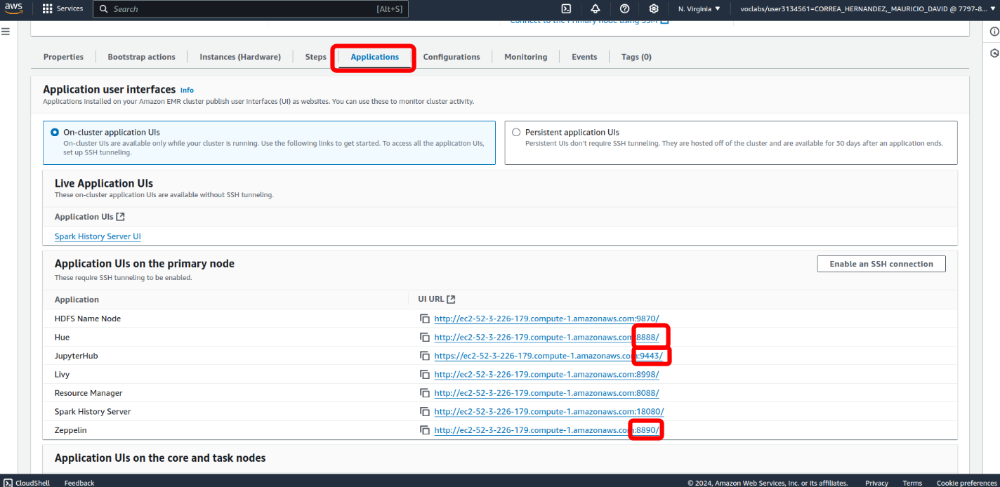
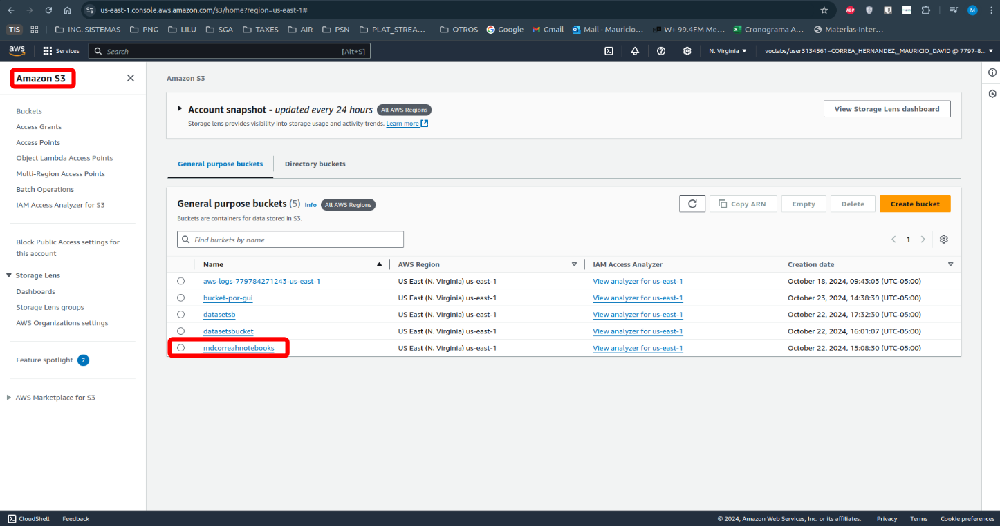
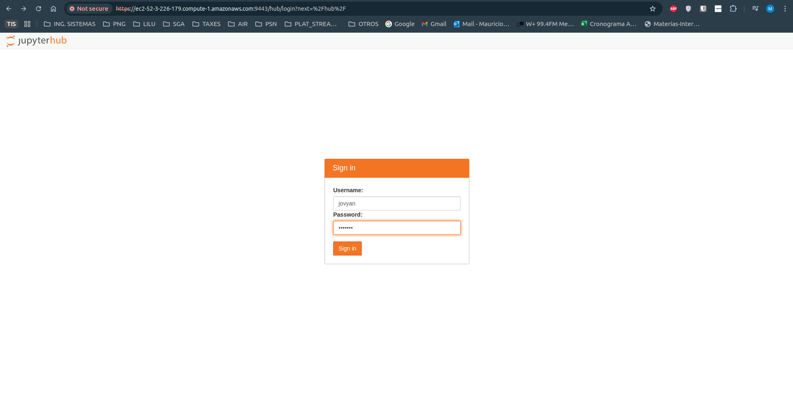
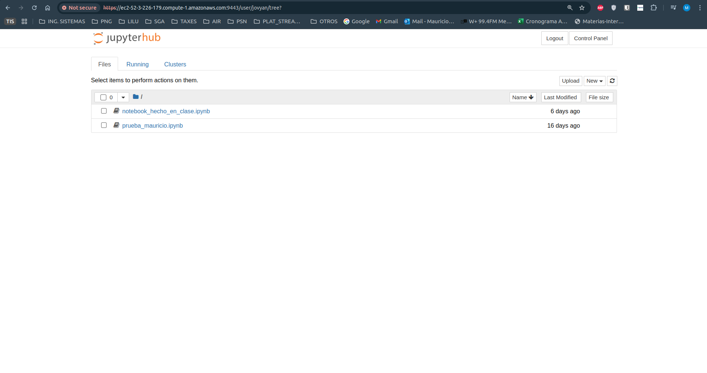
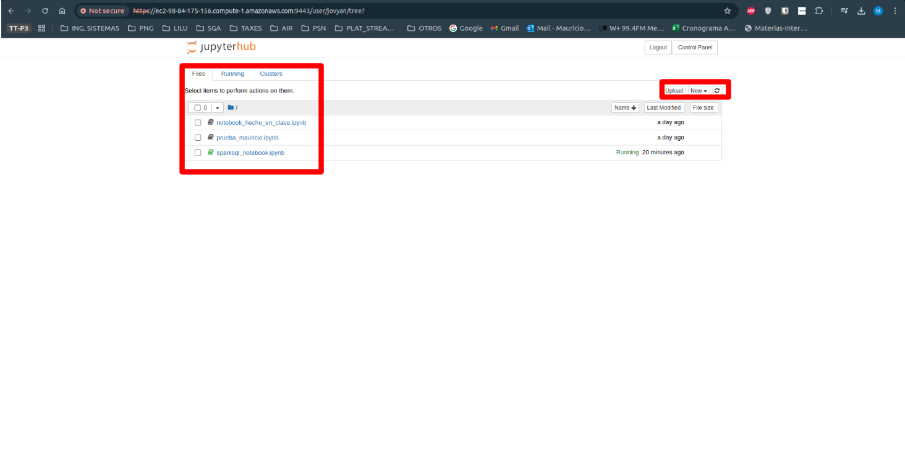
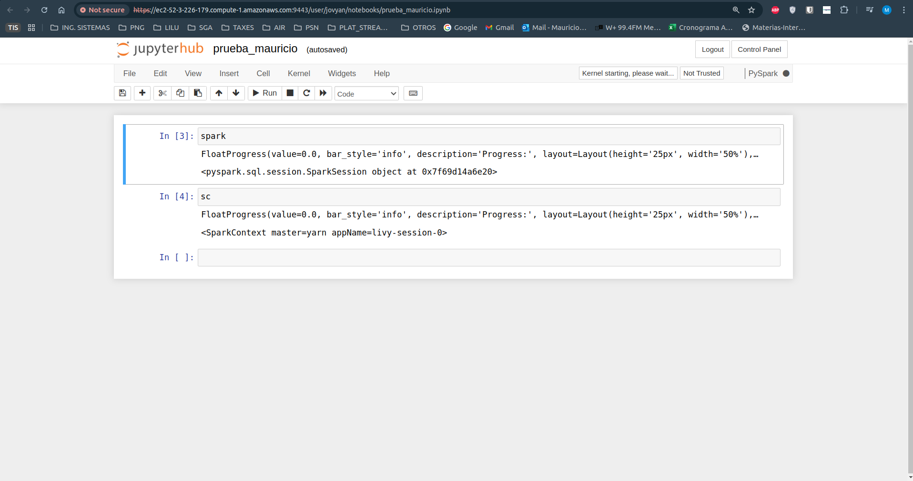

# Guía de SparkSQL.

## 1. Entrar a Jupyter Hub.

**Utilice la aplicación jupyterhub de:**



**Y darle click a la URL de Jupyter Hub, en este ejemplo:**
```
https://ec2-98-84-175-156.compute-1.amazonaws.com:9443/
```

**OJO. No olvides haber creado el bucket en S3 con el nombre de la configuración en mi caso```mdcorreah2notebooks```.**



```json
[
  {
    "Classification": "jupyter-s3-conf",
    "Properties": {
      "s3.persistence.bucket": "mdcorreah2notebooks",
      "s3.persistence.enabled": "true"
    }
  }
]
```

**Cada vez que creamos un cluster, me pide crear un usuario y clave, utilizar las siguientes credenciales por defecto.**
- **Username:** jovyan
- **Passoword:** jupyter



Tomado de: https://docs.aws.amazon.com/emr/latest/ReleaseGuide/emr-jupyterhub-user-access.html

Y listo, ya puede realizar notebooks pyspark, verifique que las 2 variables más importantes de contexto de spark esta activas en un notebook así: (primero debe crear un notebook pyspark).



**Creación o modificación de un Notebook.**



**Edición de notebooks.**




## 2. Comandos que se van a ejecutar en el notebook "sparksql_notebook.ipynb".
```sql
-- Mostrar todoas las tablas.
SHOW TABLES;

-- Mostrar 10 entradas de la tabla 'hdiens3'.
SELECT * FROM hdiens3 LIMIT 10;

-- Mostrar todas entradas de la tabla 'hdiens3'.
SELECT * FROM hdiens3;

-- Mostrar 10 entradas de la tabla 'expo'.
SELECT * FROM expo LIMIT 10;

-- Mostrar todas las entradas de la tabla 'hdiens3' donde 'gni > 2000'.
SELECT country, gni FROM hdiens3 WHERE gni > 2000;

-- Crear un join entre las tablas 'hdiens3' y 'expo' donde 'gni > 2000'
SELECT h.country, gni, expct FROM hdiens3 h JOIN expo e ON (h.country = e.country) WHERE gni > 2000;

-- Mostrar las columnas y los tipos de datos de la tabla 'hdiens3'
DESCRIBE hdiens3;

-- Creamos la tabla docs3
CREATE EXTERNAL TABLE docs3 (line STRING) 
STORED AS TEXTFILE 
LOCATION 's3://datasets-mauricio/datasets/gutenberg-small';

-- Creamos la query a la tabla llamada 'docs3'
SELECT * FROM docs3;

-- Ordenar por palabra y traer máximo 10 palabras de manera descendente
SELECT word, count(1) AS count FROM (SELECT explode(split(line,' ')) AS word FROM docs3) w 
GROUP BY word 
ORDER BY word DESC LIMIT 10;

-- Ordenar por palabra y traer todas las palabras de manera descendente
SELECT word, count(1) AS count FROM (SELECT explode(split(line,' ')) AS word FROM docs3) w 
GROUP BY word 
ORDER BY word DESC;

-- Ordenado por frecuencia de menor a mayor y traer máximo 10 palabras de manera descendente.
SELECT word, count(1) AS count FROM (SELECT explode(split(line,' ')) AS word FROM docs3) w 
GROUP BY word 
ORDER BY count DESC LIMIT 10;

-- Ordenado por frecuencia de menor a mayor y traer todas las palabras de manera descendente.
SELECT word, count(1) AS count FROM (SELECT explode(split(line,' ')) AS word FROM docs3) w 
GROUP BY word 
ORDER BY count DESC;

-- Ordenado por frecuencia de mayor a menor y traer todas las palabras de manera ascendente.
SELECT word, count(1) AS count FROM (SELECT explode(split(line,' ')) AS word FROM docs3) w 
GROUP BY word 
ORDER BY count ASC;

-- RETO
-- OPCIÓN 1.
-- Crear la tabla 'word_frequency_3' si no existe
CREATE TABLE IF NOT EXISTS word_frequency_3 (
    word STRING,
    count INT
);

-- Verificamos que la tabla esté vacía
SELECT * FROM word_frequency_3;

-- Llenar la tabla con los resultados del query
INSERT INTO word_frequency_3
SELECT word, count(1) AS count 
FROM (
    SELECT explode(split(line,' ')) AS word 
    FROM docs3
) w 
GROUP BY word 
ORDER BY count DESC;

-- Verificamos la creación del contenido de la tabla.
SELECT * FROM word_frequency_3;

-- OPCIÓN 2.
-- Crear la tabla 'word_frequency_ctas_3' si no existe
CREATE TABLE word_frequency_ctas_3 AS
SELECT word, count(1) AS count 
FROM (
    SELECT explode(split(line,' ')) AS word 
    FROM docss3
) w 
GROUP BY word 
ORDER BY count DESC;

-- Verificamos la creación del contenido de la tabla.
SELECT * FROM word_frequency_ctas_3;
```

## 3. Notebook de ejecución de SparkSQL creado para la ejecución de los comandos anteriores.

[Link para ir al notebook de SparkSQL](sparksql_notebook.ipynb)