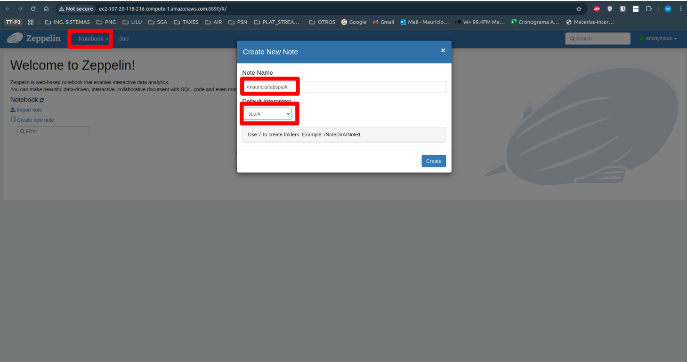

# PySpark - Parte 1.
## LAB SPARK
### 1. De forma interactiva via 'pyspark' (en el nodo master de EMR).
Ya trae preconfigurado las variables sc y spark

#### Comandos.

Como para hacer este laboratorio se crea un nuevo cluster, entonces creemos los directorios y archivos necesarios.

```bash
# Creamos directorio 'datasets'
hdfs dfs -mkdir /user/hadoop/datasets

# Creamos directorio 'gutenberg-small'
hdfs dfs -mkdir /user/hadoop/datasets/gutenberg-small

# Verificamos la creación exitosa de ambos directorios.
hdfs dfs -ls /user/hadoop/datasets/

# Ya que tenemos el bucket creado con los archivos, entonces lo vamos a descargar de S3 a Hadoop.
## Verificamos dónde está.
aws s3 ls s3://datasets-mauricio/datasets/gutenberg-small/

# Descargamos de S3 a Hadoop.
hadoop dfs -cp s3a://datasets-mauricio/datasets/gutenberg-small/* /user/hadoop/datasets/gutenberg-small/

# Verificamos la descarga 
hdfs dfs -ls /user/hadoop/datasets/gutenberg-small/
```

```bash
# Cargar desde HDFS
files_rdd = sc.textFile("hdfs:///user/hadoop/datasets/gutenberg-small/*.txt")

# O cargar desde S3
files_rdd = sc.textFile("s3://datasets-mauricio/datasets/gutenberg-small/*.txt")

# Separar líneas en palabras y contar ocurrencias
wc_unsort = files_rdd.flatMap(lambda line: line.split()).map(lambda word: (word, 1)).reduceByKey(lambda a, b: a + b)

# Ordenar palabras por frecuencia (descendente)
wc = wc_unsort.sortBy(lambda a: -a[1])

# Mostrar las 10 palabras más frecuentes
for tupla in wc.take(10):
    print(tupla)

# Guardar el resultado como múltiples archivos RDD
wc.saveAsTextFile("hdfs:///tmp/wcout1")

# Consolidar el resultado en un solo archivo.
wc.coalesce(1).saveAsTextFile("hdfs:///tmp/wcout2")
exit()
```

Para verificar la creación de estos dos archivos.

```bash
hdfs dfs -ls hdfs:///tmp/
```

Pasemos las dos carpetas a /user/hadoop/
```bash
hdfs dfs -mv hdfs:///tmp/wcout1 hdfs:///user/hadoop/
hdfs dfs -mv hdfs:///tmp/wcout2 hdfs:///user/hadoop/
```
Verificamos el contenido de las carpetas
```bash
hdfs dfs -ls hdfs:///user/hadoop/wcout1
hdfs dfs -ls hdfs:///user/hadoop/wcout2
```

#### Resultados.

```bash
[hadoop@ip-172-31-17-92 ~]$ pyspark
Python 3.9.16 (main, Jul  5 2024, 00:00:00) 
[GCC 11.4.1 20230605 (Red Hat 11.4.1-2)] on linux
Type "help", "copyright", "credits" or "license" for more information.
Setting default log level to "WARN".
To adjust logging level use sc.setLogLevel(newLevel). For SparkR, use setLogLevel(newLevel).
24/11/17 01:35:48 WARN HiveConf: HiveConf of name hive.server2.thrift.url does not exist
24/11/17 01:35:50 WARN Client: Neither spark.yarn.jars nor spark.yarn.archive is set, falling back to uploading libraries under SPARK_HOME.
24/11/17 01:35:59 WARN YarnSchedulerBackend$YarnSchedulerEndpoint: Attempted to request executors before the AM has registered!
Welcome to
      ____              __
     / __/__  ___ _____/ /__
    _\ \/ _ \/ _ `/ __/  '_/
   /__ / .__/\_,_/_/ /_/\_\   version 3.5.2-amzn-0
      /_/

Using Python version 3.9.16 (main, Jul  5 2024 00:00:00)
Spark context Web UI available at http://ip-172-31-17-92.ec2.internal:4040
Spark context available as 'sc' (master = yarn, app id = application_1731803816921_0006).
SparkSession available as 'spark'.
>>> files_rdd = sc.textFile("hdfs:///user/hadoop/datasets/gutenberg-small/*.txt")
>>> files_rdd = sc.textFile("s3://datasets-mauricio/datasets/gutenberg-small/*.txt")
>>> # Separar líneas en palabras y contar ocurrencias
>>> wc_unsort = files_rdd.flatMap(lambda line: line.split()) \
...                      .map(lambda word: (word, 1)) \
...                      .reduceByKey(lambda a, b: a + b)
>>> 
>>> # Ordenar palabras por frecuencia (descendente)
>>> wc = wc_unsort.sortBy(lambda a: -a[1])

>>>                                                                             
>>> for tupla in wc.take(10):
...     print(tupla)
... 
('the', 44647)
('of', 28020)
('to', 23208)
('and', 20444)
('in', 13174)
('that', 12265)
('I', 10880)
('a', 10431)
('is', 7776)
('be', 7148)
>>> wc.saveAsTextFile("hdfs:///tmp/wcout1")
>>> wc.coalesce(1).saveAsTextFile("hdfs:///tmp/wcout2")                         
>>> exit()
[hadoop@ip-172-31-17-92 ~]$ hdfs dfs -ls hdfs:///tmp/
Found 5 items
drwxrwxrwt   - yarn   hdfsadmingroup          0 2024-11-17 00:42 hdfs:///tmp/entity-file-history
drwxrwxrwx   - mapred mapred                  0 2024-11-17 00:36 hdfs:///tmp/hadoop-yarn
drwx-wx-wx   - hive   hdfsadmingroup          0 2024-11-17 00:38 hdfs:///tmp/hive
drwxr-xr-x   - hadoop hdfsadmingroup          0 2024-11-17 01:36 hdfs:///tmp/wcout1
drwxr-xr-x   - hadoop hdfsadmingroup          0 2024-11-17 01:37 hdfs:///tmp/wcout2
[hadoop@ip-172-31-17-92 ~]$ hdfs dfs -mv hdfs:///tmp/wcout1 hdfs:///user/hadoop/
[hadoop@ip-172-31-17-92 ~]$ hdfs dfs -mv hdfs:///tmp/wcout2 hdfs:///user/hadoop/
[hadoop@ip-172-31-17-92 ~]$ hdfs dfs -ls hdfs:///user/hadoop/
Found 4 items
drwxr-xr-x   - hadoop hdfsadmingroup          0 2024-11-17 01:38 hdfs:///user/hadoop/.sparkStaging
drwxr-xr-x   - hadoop hdfsadmingroup          0 2024-11-17 01:22 hdfs:///user/hadoop/datasets
drwxr-xr-x   - hadoop hdfsadmingroup          0 2024-11-17 01:36 hdfs:///user/hadoop/wcout1
drwxr-xr-x   - hadoop hdfsadmingroup          0 2024-11-17 01:37 hdfs:///user/hadoop/wcout2
[hadoop@ip-172-31-17-92 ~]$ hdfs dfs -ls hdfs:///user/hadoop/wcout1
Found 17 items
-rw-r--r--   1 hadoop hdfsadmingroup          0 2024-11-17 01:36 hdfs:///user/hadoop/wcout1/_SUCCESS
-rw-r--r--   1 hadoop hdfsadmingroup      40180 2024-11-17 01:36 hdfs:///user/hadoop/wcout1/part-00000
-rw-r--r--   1 hadoop hdfsadmingroup      53436 2024-11-17 01:36 hdfs:///user/hadoop/wcout1/part-00001
-rw-r--r--   1 hadoop hdfsadmingroup      29558 2024-11-17 01:36 hdfs:///user/hadoop/wcout1/part-00002
-rw-r--r--   1 hadoop hdfsadmingroup      15828 2024-11-17 01:36 hdfs:///user/hadoop/wcout1/part-00003
-rw-r--r--   1 hadoop hdfsadmingroup      53217 2024-11-17 01:36 hdfs:///user/hadoop/wcout1/part-00004
-rw-r--r--   1 hadoop hdfsadmingroup      50878 2024-11-17 01:36 hdfs:///user/hadoop/wcout1/part-00005
-rw-r--r--   1 hadoop hdfsadmingroup     104312 2024-11-17 01:36 hdfs:///user/hadoop/wcout1/part-00006
-rw-r--r--   1 hadoop hdfsadmingroup          0 2024-11-17 01:36 hdfs:///user/hadoop/wcout1/part-00007
-rw-r--r--   1 hadoop hdfsadmingroup          0 2024-11-17 01:36 hdfs:///user/hadoop/wcout1/part-00008
-rw-r--r--   1 hadoop hdfsadmingroup     284244 2024-11-17 01:36 hdfs:///user/hadoop/wcout1/part-00009
-rw-r--r--   1 hadoop hdfsadmingroup          0 2024-11-17 01:36 hdfs:///user/hadoop/wcout1/part-00010
-rw-r--r--   1 hadoop hdfsadmingroup          0 2024-11-17 01:36 hdfs:///user/hadoop/wcout1/part-00011
-rw-r--r--   1 hadoop hdfsadmingroup          0 2024-11-17 01:36 hdfs:///user/hadoop/wcout1/part-00012
-rw-r--r--   1 hadoop hdfsadmingroup          0 2024-11-17 01:36 hdfs:///user/hadoop/wcout1/part-00013
-rw-r--r--   1 hadoop hdfsadmingroup          0 2024-11-17 01:36 hdfs:///user/hadoop/wcout1/part-00014
-rw-r--r--   1 hadoop hdfsadmingroup          0 2024-11-17 01:36 hdfs:///user/hadoop/wcout1/part-00015
[hadoop@ip-172-31-17-92 ~]$ hdfs dfs -ls hdfs:///user/hadoop/wcout2/
Found 2 items
-rw-r--r--   1 hadoop hdfsadmingroup          0 2024-11-17 01:37 hdfs:///user/hadoop/wcout2/_SUCCESS
-rw-r--r--   1 hadoop hdfsadmingroup     631653 2024-11-17 01:37 hdfs:///user/hadoop/wcout2/part-00000
```


### 2. Como un archivo python: [wc-pyspark-mauricio.py](wc-pyspark-mauricio.py)

#### Creemos el archivo para ejecutar de manera local.
**Comandos.**
```bash
# Comando para crear el archivo.
touch wc-pyspark-mauricio.py

# Comando para crear el contenido del archivo.
nano wc-pyspark-mauricio.py
## Ingresamos el contenido que está en el enlace de arriba en el título 2.

# Comando para ejectuar el archivo.
spark-submit --master yarn --deploy-mode cluster wc-pyspark-mauricio.py

# Para verificar la creación de estos dos archivos.
hdfs dfs -ls hdfs:///tmp/

# Pasemos las dos carpetas a /user/hadoop/
hdfs dfs -mv hdfs:///tmp/wcout3 hdfs:///user/hadoop/

# Verificamos el contenido de las carpetas
hdfs dfs -ls hdfs:///user/hadoop/wcout3/
```

**Resultados.**
```bash
[hadoop@ip-172-31-17-92 ~]$ touch wc-pyspark-mauricio.py       
[hadoop@ip-172-31-17-92 ~]$ nano wc-pyspark-mauricio.py
[hadoop@ip-172-31-17-92 ~]$ spark-submit --master yarn --deploy-mode cluster wc-pyspark-mauricio.py
24/11/17 02:02:28 WARN NativeCodeLoader: Unable to load native-hadoop library for your platform... using builtin-java classes where applicable
24/11/17 02:02:28 INFO DefaultNoHARMFailoverProxyProvider: Connecting to ResourceManager at ip-172-31-17-92.ec2.internal/172.31.17.92:8032
24/11/17 02:02:29 INFO Configuration: resource-types.xml not found
24/11/17 02:02:29 INFO ResourceUtils: Unable to find 'resource-types.xml'.
24/11/17 02:02:29 INFO Client: Verifying our application has not requested more than the maximum memory capability of the cluster (12288 MB per container)
24/11/17 02:02:29 INFO Client: Will allocate AM container, with 2432 MB memory including 384 MB overhead
24/11/17 02:02:29 INFO Client: Setting up container launch context for our AM
24/11/17 02:02:29 INFO Client: Setting up the launch environment for our AM container
24/11/17 02:02:29 INFO Client: Preparing resources for our AM container
24/11/17 02:02:29 WARN Client: Neither spark.yarn.jars nor spark.yarn.archive is set, falling back to uploading libraries under SPARK_HOME.
24/11/17 02:02:31 INFO Client: Uploading resource file:/mnt/tmp/spark-35c9a10b-67ae-45d6-bd9c-fe314b5dee6e/__spark_libs__15637290797342392406.zip -> hdfs://ip-172-31-17-92.ec2.internal:8020/user/hadoop/.sparkStaging/application_1731803816921_0007/__spark_libs__15637290797342392406.zip
24/11/17 02:02:32 INFO Client: Uploading resource file:/etc/spark/conf.dist/hive-site.xml -> hdfs://ip-172-31-17-92.ec2.internal:8020/user/hadoop/.sparkStaging/application_1731803816921_0007/hive-site.xml
24/11/17 02:02:32 INFO Client: Uploading resource file:/etc/hudi/conf.dist/hudi-defaults.conf -> hdfs://ip-172-31-17-92.ec2.internal:8020/user/hadoop/.sparkStaging/application_1731803816921_0007/hudi-defaults.conf
24/11/17 02:02:32 INFO Client: Uploading resource file:/home/hadoop/wc-pyspark-mauricio.py -> hdfs://ip-172-31-17-92.ec2.internal:8020/user/hadoop/.sparkStaging/application_1731803816921_0007/wc-pyspark-mauricio.py
24/11/17 02:02:32 INFO Client: Uploading resource file:/usr/lib/spark/python/lib/pyspark.zip -> hdfs://ip-172-31-17-92.ec2.internal:8020/user/hadoop/.sparkStaging/application_1731803816921_0007/pyspark.zip
24/11/17 02:02:32 INFO Client: Uploading resource file:/usr/lib/spark/python/lib/py4j-0.10.9.7-src.zip -> hdfs://ip-172-31-17-92.ec2.internal:8020/user/hadoop/.sparkStaging/application_1731803816921_0007/py4j-0.10.9.7-src.zip
24/11/17 02:02:32 INFO Client: Uploading resource file:/mnt/tmp/spark-35c9a10b-67ae-45d6-bd9c-fe314b5dee6e/__spark_conf__18214636072600960254.zip -> hdfs://ip-172-31-17-92.ec2.internal:8020/user/hadoop/.sparkStaging/application_1731803816921_0007/__spark_conf__.zip
24/11/17 02:02:33 INFO SecurityManager: Changing view acls to: hadoop
24/11/17 02:02:33 INFO SecurityManager: Changing modify acls to: hadoop
24/11/17 02:02:33 INFO SecurityManager: Changing view acls groups to: 
24/11/17 02:02:33 INFO SecurityManager: Changing modify acls groups to: 
24/11/17 02:02:33 INFO SecurityManager: SecurityManager: authentication disabled; ui acls disabled; users with view permissions: hadoop; groups with view permissions: EMPTY; users with modify permissions: hadoop; groups with modify permissions: EMPTY
24/11/17 02:02:33 INFO Client: Submitting application application_1731803816921_0007 to ResourceManager
24/11/17 02:02:33 INFO YarnClientImpl: Submitted application application_1731803816921_0007
24/11/17 02:02:34 INFO Client: Application report for application_1731803816921_0007 (state: ACCEPTED)
24/11/17 02:02:34 INFO Client: 
	 client token: N/A
	 diagnostics: AM container is launched, waiting for AM container to Register with RM
	 ApplicationMaster host: N/A
	 ApplicationMaster RPC port: -1
	 queue: root.default
	 start time: 1731808953339
	 final status: UNDEFINED
	 tracking URL: http://ip-172-31-17-92.ec2.internal:20888/proxy/application_1731803816921_0007/
	 user: hadoop
24/11/17 02:02:42 INFO Client: Application report for application_1731803816921_0007 (state: RUNNING)
24/11/17 02:02:42 INFO Client: 
	 client token: N/A
	 diagnostics: N/A
	 ApplicationMaster host: ip-172-31-19-54.ec2.internal
	 ApplicationMaster RPC port: 39917
	 queue: root.default
	 start time: 1731808953339
	 final status: UNDEFINED
	 tracking URL: http://ip-172-31-17-92.ec2.internal:20888/proxy/application_1731803816921_0007/
	 user: hadoop
24/11/17 02:02:56 INFO Client: Application report for application_1731803816921_0007 (state: FINISHED)
24/11/17 02:02:56 INFO Client: 
	 client token: N/A
	 diagnostics: N/A
	 ApplicationMaster host: ip-172-31-19-54.ec2.internal
	 ApplicationMaster RPC port: 39917
	 queue: root.default
	 start time: 1731808953339
	 final status: SUCCEEDED
	 tracking URL: http://ip-172-31-17-92.ec2.internal:20888/proxy/application_1731803816921_0007/
	 user: hadoop
24/11/17 02:02:56 INFO ShutdownHookManager: Shutdown hook called
24/11/17 02:02:56 INFO ShutdownHookManager: Deleting directory /mnt/tmp/spark-35c9a10b-67ae-45d6-bd9c-fe314b5dee6e
24/11/17 02:02:56 INFO ShutdownHookManager: Deleting directory /mnt/tmp/spark-9ccb3be6-0a73-4df8-a612-7f9c2d67f00f
[hadoop@ip-172-31-17-92 ~]$ hdfs dfs -ls hdfs:///tmp/
Found 4 items
drwxrwxrwt   - yarn   hdfsadmingroup          0 2024-11-17 00:42 hdfs:///tmp/entity-file-history
drwxrwxrwx   - mapred mapred                  0 2024-11-17 00:36 hdfs:///tmp/hadoop-yarn
drwx-wx-wx   - hive   hdfsadmingroup          0 2024-11-17 00:38 hdfs:///tmp/hive
drwxr-xr-x   - hadoop hdfsadmingroup          0 2024-11-17 02:02 hdfs:///tmp/wcout3
[hadoop@ip-172-31-17-92 ~]$ hdfs dfs -mv hdfs:///tmp/wcout3 hdfs:///user/hadoop/
[hadoop@ip-172-31-17-92 ~]$ hdfs dfs -ls hdfs:///user/hadoop/wcout3/
Found 2 items
-rw-r--r--   1 hadoop hdfsadmingroup          0 2024-11-17 02:02 hdfs:///user/hadoop/wcout3/_SUCCESS
-rw-r--r--   1 hadoop hdfsadmingroup     631653 2024-11-17 02:02 hdfs:///user/hadoop/wcout3/part-00000
```

### 3. Desde Zeppelin Nodebook:

**Ingresamos a Zeppelin.**

Ejemplo de link: http://ec2-107-20-118-216.compute-1.amazonaws.com:8890/

* Si es en EMR, por defecto NO tiene login/pass

    

* **Cree un Notebook:**

    

    
    ```bash
    # El nombre del notebook que yo cree fue:
    /mauricio/labspark
    ## Esto lo que hace es crear un directorio llamado 'mauricio' y el notebook 'labspark'
    ```

- **Wordcount en python:**

    ```python
    %spark.pyspark
    # WORDCOUNT COMPACTO
    # Cargar desde HDFS
    files_rdd = sc.textFile("hdfs:///user/hadoop/datasets/gutenberg-small/*.txt")

    # O cargar desde S3
    #files_rdd = sc.textFile("s3://datasets-mauricio/datasets/gutenberg-small/*.txt")

    # Separar líneas en palabras y contar ocurrencias
    wc_unsort = files_rdd.flatMap(lambda line: line.split()).map(lambda word: (word, 1)).reduceByKey(lambda a, b: a + b)

    # Ordenar palabras por frecuencia (descendente)
    wc = wc_unsort.sortBy(lambda a: -a[1])

    # Mostrar las 10 palabras más frecuentes
    for tupla in wc.take(10):
        print(tupla)

    # Guardar el resultado como múltiples archivos RDD
    wc.saveAsTextFile("hdfs:///tmp/wcout1")

    # Consolidar el resultado en un solo archivo.
    wc.coalesce(1).saveAsTextFile("hdfs:///user/hadoop/wcout4")
    ```

- **Verificamos el archivo creado al final 'wcout4'.**
    ```bash
    [hadoop@ip-172-31-17-92 ~]$ hdfs dfs -ls hdfs:///user/hadoop/wcout4
    Found 2 items
    -rw-r--r--   1 zeppelin hdfsadmingroup          0 2024-11-17 02:26 hdfs:///user/hadoop/wcout4/_SUCCESS
    -rw-r--r--   1 zeppelin hdfsadmingroup     631653 2024-11-17 02:26 hdfs:///user/hadoop/wcout4/part-00000
    ```
- **El Notebook que utilicé fue este:**

    [labspark.ipynb](labspark.ipynb)

- **El último Notebook con el que probé las configuraciones e instalaciones de los paquetes es este:** [wordcount-spark-mauricio.ipynb](wordcount-spark-mauricio.ipynb)