# PySpark - Parte 2.

## Lab 3-3 - Spark con Notebooks y PySpark.

- Realice la reproducción y entendimiento de los notebooks que hay en: [04-spark](../../bigdata/04-spark/README.md): 

    Realizada en: [Parte 1](../part-1/guia-pyspark-parte-1.md)

- Teniendo como entrada los datos ejemplo: datasets/covid19/Casos_positivos_de_COVID-19_en_Colombia.csv

    Si quiere trabajar con los últimos datos, descarguelos de: 
    ```bash
    # Link de descarga
    https://www.datos.gov.co/api/views/gt2j-8ykr/rows.csv?accessType=DOWNLOAD

    # Ejecute el comando:
    wget https://www.datos.gov.co/api/views/gt2j-8ykr/rows.csv?accessType=DOWNLOAD

    # O tambien están en el github: 
    datasets/covid19/Casos_positivos_de_COVID-19_en_Colombia.csv.zip
    ```
    **Utilizando como base el jupyter notebook: [/bigdata/04-spark/Data_processing_using_PySpark.ipynb](../../bigdata/04-spark/Data_processing_using_PySpark.ipynb) realice sobre los datos de covid.**

## 1. Almacenar datos en AWS S3 y en google drive (ojo, en ambos)
### 1.1. Almacenamiento en AWS S3.
- #### Iniciamos con la descarga del archivo usando el comando wget en el ambiente local de la máquina master del sistema.
    ***Nota: Esto puede tardar un poco ya que el archivo es bastante pesado (1.10 Gb).***
    ```bash
    # Comando para que me descargue el archivo con el nombre 'Covid19-Colombia.csv'.
     wget -O Covid19-Colombia.csv "https://www.datos.gov.co/api/views/gt2j-8ykr/rows.csv?accessType=DOWNLOAD"
    ```
    **Resultado final.**
    ```bash
    [hadoop@ip-172-31-59-169 ~]$ wget -O Covid19-Colombia.csv "https://www.datos.gov.co/api/views/gt2j-8ykr/rows.csv?accessType=DOWNLOAD"
    --2024-11-18 03:45:07--  https://www.datos.gov.co/api/views/gt2j-8ykr/rows.csv?accessType=DOWNLOAD
    Resolving www.datos.gov.co (www.datos.gov.co)... 52.206.140.199, 52.206.140.205, 52.206.68.26
    Connecting to www.datos.gov.co (www.datos.gov.co)|52.206.140.199|:443... connected.
    HTTP request sent, awaiting response... 200 OK
    Length: unspecified [text/csv]
    Saving to: ‘Covid19-Colombia.csv’

    Covid19-Colombia.csv                                     [                                      <=>                                                                             ]   1.10G  7.10MB/s    in 2m 43s  

    2024-11-18 03:47:50 (6.92 MB/s) - ‘Covid19-Colombia.csv’ saved [1181518251]

    [hadoop@ip-172-31-59-169 ~]$ ls
    Covid19-Colombia.csv  st0263-242
    ```
- #### Pasamos el archivo a AWS S3. Para ello, vamos a crear un nuevo bucket y tres directorios en el bucket.
    **Comandos**
    ```bash
    # Comando que crea el bicket 'covid19bucket-mauricio'.
    aws s3api create-bucket --bucket covid19bucket-mauricio --region us-east-1

    # Comando pare verificar la creación del bucket 'covid19bucket-mauricio', mostrando todos los buckets actuales
    aws s3 ls

    # Comandos que crea los directorios 'Raw', 'Trusted' y 'Refined' en el bucket covid19bucket-mauricio.
    aws s3api put-object --bucket covid19bucket-mauricio --key Raw/
    aws s3api put-object --bucket covid19bucket-mauricio --key Trusted/
    aws s3api put-object --bucket covid19bucket-mauricio --key Refined/

    # Comando para verificar la creación de los tres directorios.
    aws s3 ls s3://covid19bucket-mauricio/

    # Subir el archivo descargado a la zona RAW.
    aws s3 cp Covid19-Colombia.csv s3://covid19bucket-mauricio/Raw/

    # Comando para verificar la subida del archivo a la zona RAW.
    aws s3 ls s3://covid19bucket-mauricio/Raw/
    ```

    **Resultados.**
    ```bash
    [hadoop@ip-172-31-59-169 ~]$ aws s3api create-bucket --bucket covid19bucket-mauricio --region us-east-1
    {
        "Location": "/covid19bucket-mauricio"
    }
    [hadoop@ip-172-31-59-169 ~]$ aws s3 ls
    2024-11-18 03:55:46 covid19bucket-mauricio
    2024-11-17 05:16:22 datasets-mauricio
    2024-11-17 05:15:50 mdcorreah2notebooks
    [hadoop@ip-172-31-59-169 ~]$ aws s3api put-object --bucket covid19bucket-mauricio --key Raw/
    {
        "ETag": "\"d41d8cd98f00b204e9800998ecf8427e\"",
        "ServerSideEncryption": "AES256"
    }
    [hadoop@ip-172-31-59-169 ~]$ aws s3api put-object --bucket covid19bucket-mauricio --key Trusted/
    {
        "ETag": "\"d41d8cd98f00b204e9800998ecf8427e\"",
        "ServerSideEncryption": "AES256"
    }
    [hadoop@ip-172-31-59-169 ~]$ aws s3api put-object --bucket covid19bucket-mauricio --key Refined/
    {
        "ETag": "\"d41d8cd98f00b204e9800998ecf8427e\"",
        "ServerSideEncryption": "AES256"
    }
    [hadoop@ip-172-31-59-169 ~]$ aws s3 ls s3://covid19bucket-mauricio/
                            PRE Raw/
                            PRE Refined/
                            PRE Trusted/
    [hadoop@ip-172-31-59-169 ~]$ aws s3 cp Covid19-Colombia.csv s3://covid19bucket-mauricio/Raw/
    upload: ./Covid19-Colombia.csv to s3://covid19bucket-mauricio/Raw/Covid19-Colombia.csv
    [hadoop@ip-172-31-59-169 ~]$ aws s3 ls s3://covid19bucket-mauricio/Raw/
    2024-11-18 03:58:56          0 
    2024-11-18 05:11:43 1181518251 Covid19-Colombia.csv
    ```

### 1.2. Almacenamiento en Google Drive.

- #### 1.2.1. Ingresamos al repositorio de la clase y descargamos el zip.

    **Nota: Debemos descomprimir el archivo luego.**

    [Link del repositorio de la materia.](https://github.com/st0263eafit/st0263-242/tree/main)

    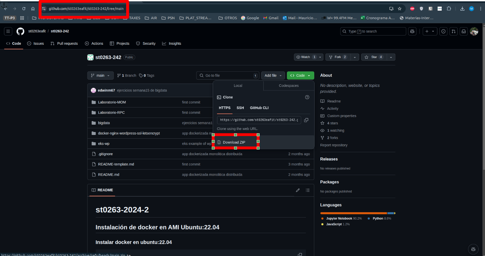
- #### 1.2.2. Ingresamos al drive personal o de la empresa.

    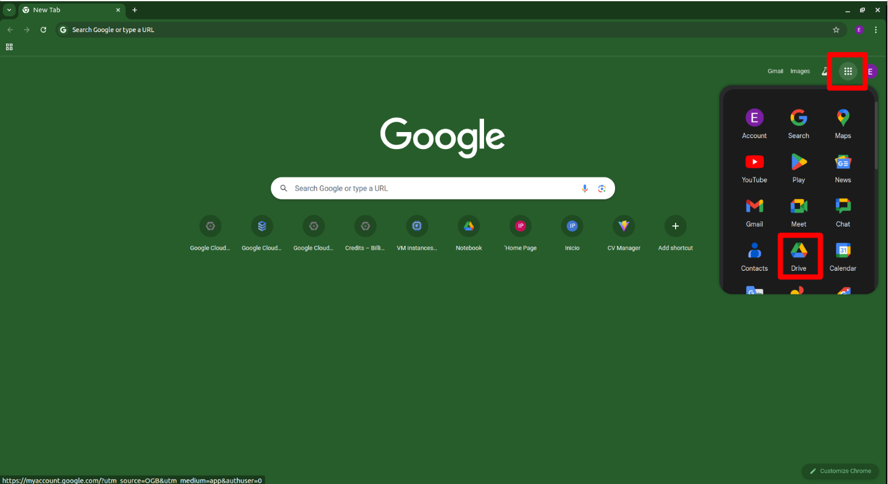

- #### 1.2.3. Ingresamos a 'Mi unidad' u seleccionamos el lugar donde vamos a subir la carpeta.

    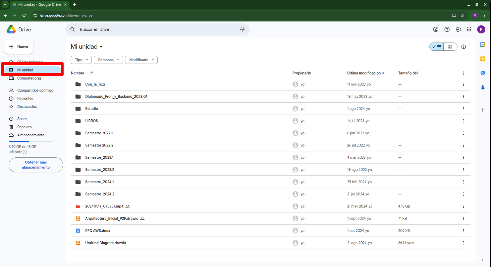

- #### 1.2.4. En mi caso, la carpeta va a quedar dentro de otos archivos.

    **Nota: Tener muy presente esta ubicación para cambios en archivos posteriores.**

    Le damos en clic derecho y subir carpeta.

    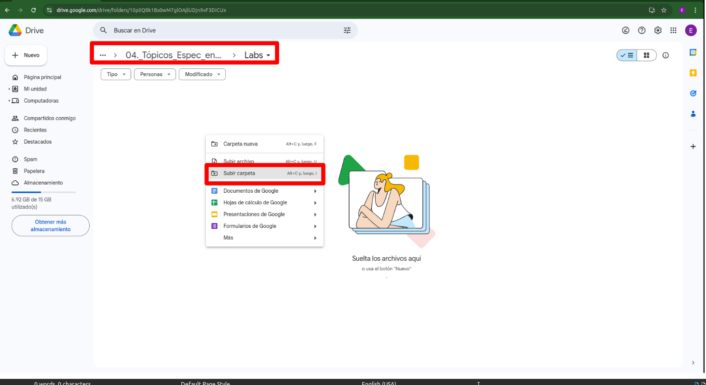

- #### 1.2.5. Buscamos la carpeta descargada y descomprimida y le damos cargar.

    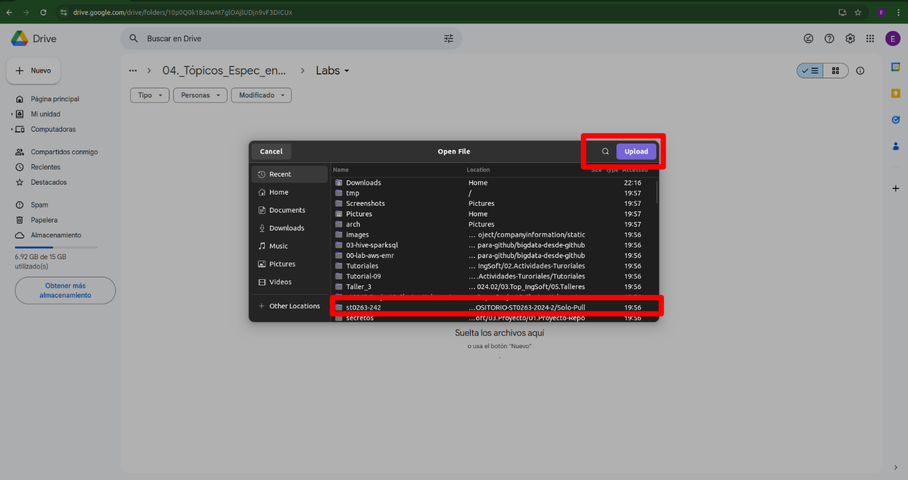

- #### 1.2.6. La carpeta queda cargada correctamente.

    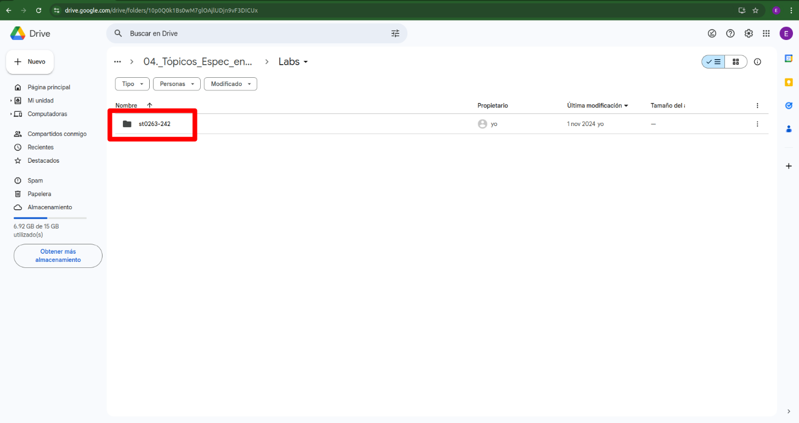

## 2. Análisis exploratorio de datos en dataframes donde cargamos los datos: (programa en jupyterhub y google colab)

### CON JUPYTERHUB
**Vamos a utilizar el ejemplo del notebook presentado aquí, pero modificándolo para trabajar con el archivo descargado de Covid19.**

**[Data_processing_using_PySpark.ipynb](notebooks-contenido/Data_processing_using_PySpark.ipynb)**

**Cargamos el notebook a jupyterhub.**

- **Cargamos el notebook desde nuestro sistema local.**
    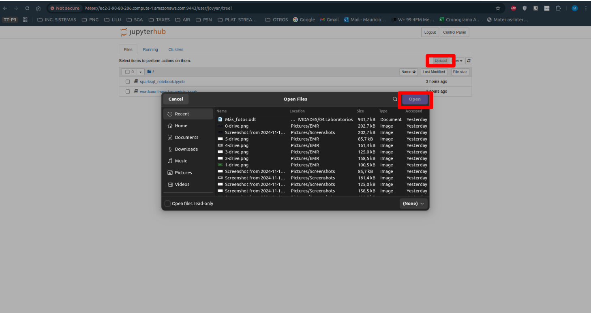

- **Le damos upload para cargar el notebook a Jupyterhub.**
    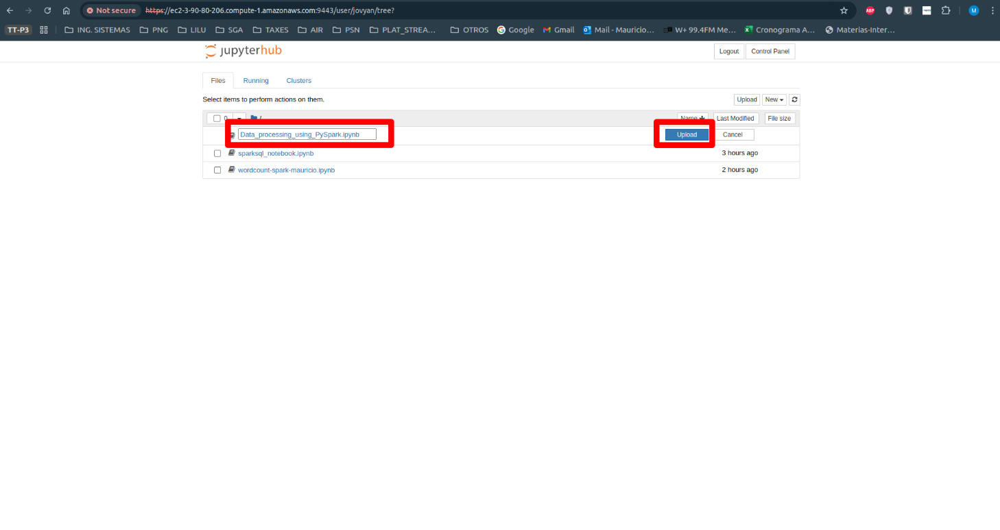

- **El archivo debió haberse subido correctamente.**
    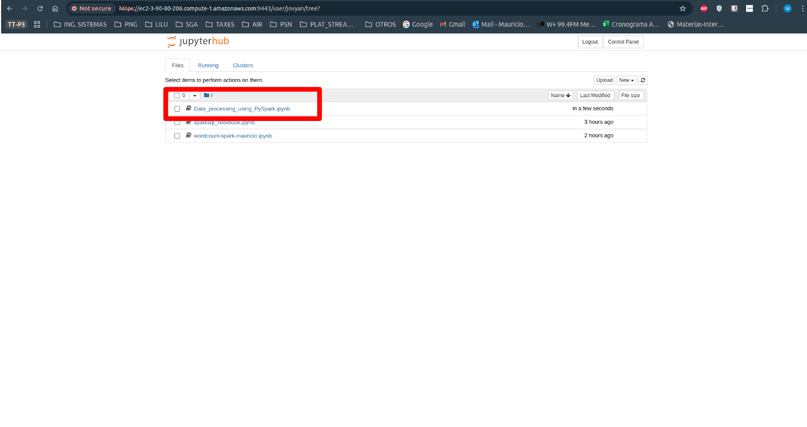

## Para ver el desarrollo de los puntos del 2 al 5, ver los Notebooks.

- ### [Ver el notebook realizado en Google Colab](notebooks-solucion/Data_processing_using_PySpark_google_colab_covid_for_lab.ipynb)
- ### [Ver el notebook realizado en AWS](notebooks-solucion/Data_processing_using_PySpark_covid_for_lab.ipynb)

## Entregables:

### 1. El notebook .ipynb donde desarrolla los numerales 2.x y 3.x
Para ver este punto es solo ir a la sección anterior.
**[Para ver el desarrollo de los puntos del 2 al 5, ver los Notebooks.](#para-ver-el-desarrollo-de-los-puntos-del-2-al-5-ver-los-notebooks)**


### 2. La URI del S3 donde están los datos de entrada y salida del numeral 3.x

URIs.
- Datos de entrada: s3://covid19bucket-mauricio/Raw/Covid19-Colombia.csv

- Datos de salida: s3://covid19bucket-mauricio/Refined/dfprocessed.csv

Evidencias.
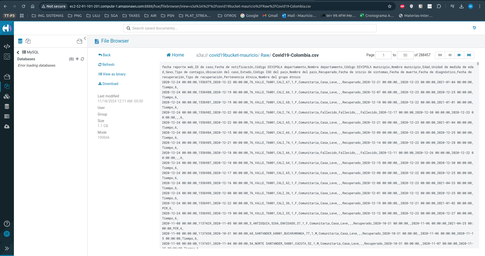
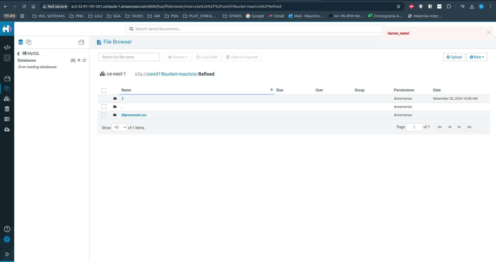
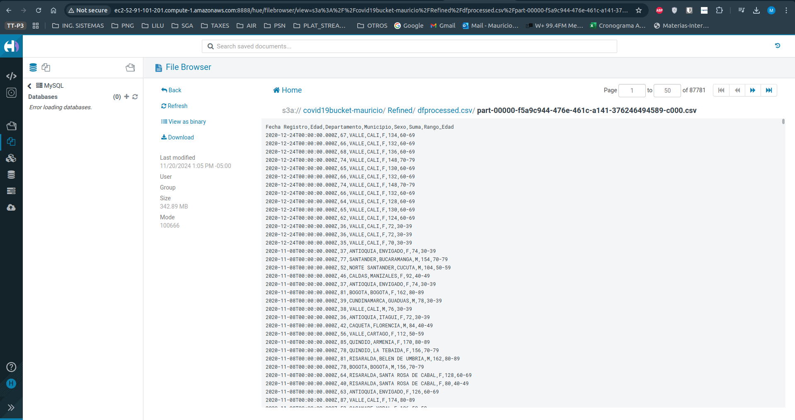

### 3. Notebooks y URI entregados vía Buzón de Interactiva Virtual.
Ver secciones anteriores.